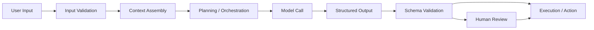

# JEV (typesaft) AI

## Overview

JEV (typesaft) AI is a practical approach to building intelligent systems that are safer, more reliable, and easier to reason about. The idea is simple: if the system is built with clear structure, typed data, and predictable validation, it becomes much easier to trust the output and manage complexity.

In modern AI workflows, most failures do not happen because the model is “bad.” They happen because the surrounding system is loosely defined. Inputs are messy, outputs are unstructured, and the integration layer does not enforce contracts. JEV (typesaft) AI addresses this by bringing discipline into the AI pipeline.

## Why Type Safety Matters in AI

When an AI system receives free-form input, the risk of ambiguity is high. A model may interpret a user request differently from the developer’s intention, especially when the same concept can appear in many forms. Type-safe design reduces this uncertainty by defining what kind of data is expected and what shape the output should follow.

This is important in real-world use cases such as:

- customer support automation
- document summarization
- legal and financial analysis
- intelligent internal assistants
- workflow orchestration with tool calling

Without structure, these systems may return inconsistent results, break downstream tools, or produce responses that are technically plausible but operationally wrong.

## Core Principles

### 1. Clear Input Contracts
The system should define expected inputs before processing begins. For example, instead of one vague prompt that accepts anything, the system can enforce a schema for fields like user role, task type, deadline, risk level, and constraints.

This helps ensure the AI is working with relevant information instead of guessing.

### 2. Structured Outputs
The model should generate outputs in a predictable format. Structured responses can be validated before they are used. This reduces the chance of invalid or unsafe data reaching other systems.

For instance, a model may return a JSON object with strictly defined fields rather than a free-form natural language answer.

### 3. Validation Before Action
A type-safe AI workflow should not blindly trust model output. The output should be checked against its required schema or rules before it triggers an action.

This is particularly important when AI is connected to:

- databases
- APIs
- business workflows
- automation scripts
- transaction systems

### 4. Human-Aware Guardrails
Type safety is not just about code. It is also about designing the system to respect boundaries. The AI should operate within known constraints, avoid unsupported actions, and escalate to humans when the task is ambiguous or risky.

## The Reading Purpose

JEV (typesaft) AI is useful for reading because it reframes AI not as a magical black box, but as a system that benefits from engineering discipline. It encourages an understanding of how data flows, how models are constrained, and how reliability is built over time.

This perspective matters because many AI projects fail not due to lack of intelligence, but due to lack of governance. A good AI architecture should be clear enough that developers can inspect, validate, and improve it.

## Architecture of a Type-Safe AI System

A strong JEV (typesaft) AI architecture is layered. Each layer has a specific responsibility and communicates through explicit contracts rather than vague text.

### 1. Input Layer
This layer receives raw user requests, data, context, or system events. It normalizes and validates incoming information before it reaches the model.

Examples include:

- UI forms
- API payloads
- chat messages
- uploaded documents
- event triggers from internal systems

The input layer should convert unstructured data into well-defined objects with types and required fields.

### 2. Context and Memory Layer
The system maintains relevant state, historical context, and task-specific memory. This helps the model reason correctly without overloading it with irrelevant information.

Good context management includes:

- user role and permissions
- prior interaction summary
- workflow state
- business rules
- tool availability

This layer prevents the model from “hallucinating” missing context.

### 3. Planning and Orchestration Layer
This is where the system decides what to do next. It may route requests, select tools, choose a model, or create a multi-step plan.

Typical responsibilities:

- classify intent
- decide if human review is required
- call proper tools or APIs
- break big tasks into smaller subtasks
- monitor safety and policy constraints

This layer acts like a coordinator and keeps the system deterministic where possible.

### 4. Model Interaction Layer
The model receives well-formed instructions and structured context. It produces output in a restricted format, not free-form prose alone.

This layer should enforce:

- prompt templates
- schema-aware output formatting
- tool call constraints
- fallback strategies for uncertainty

### 5. Validation and Enforcement Layer
Before the result is applied, it is checked against rules and schemas. This is the critical safety checkpoint in the architecture.

Validation may include:

- data type verification
- required field checks
- enum or range constraints
- business rule validation
- policy checks
- human approval gates

If validation fails, the system should reject, retry, or ask for clarification.

### 6. Execution and Action Layer
Once validated, the output can trigger real actions such as:

- API calls
- database writes
- workflow execution
- notifications
- document generation

This layer must be careful, because once data reaches the action layer, the system is no longer “just reasoning” — it is operating in the real world.

### Typical Flow

A simplified architecture can be represented as:

This flow is important because it creates checkpoints. Each checkpoint reduces the chance that unsafe or malformed data reaches the next stage.

## Benefits of a Type-Safe AI Approach

- Better consistency in outputs
- Lower risk of invalid actions
- Easier debugging and testing
- Better integration with tools and APIs
- Stronger trust in production systems
- Cleaner collaboration between developers and model designers

When AI output is structured and validated, teams can move faster with more confidence.

## Simple Example

Imagine an AI assistant that schedules meetings. Without type-safe design, the model may produce vague text like “Let’s meet next week.” That is ambiguous and can easily break scheduling logic.

With JEV (typesaft) AI, the system may define a schema such as:

- meeting_title: string
- date: ISO date
- time: time slot
- participants: array of emails
- meeting_type: enum

Before sending the data to the calendar API, the system validates each field. This ensures the AI is not inventing missing values or creating unusable scheduling data.

## Final Thought

JEV (typesaft) AI is a reminder that intelligence alone is not enough. A powerful AI system becomes dependable when it is designed with clear rules, predictable structures, and safety checks. In other words, the smartest systems are not only expressive—they are disciplined.

This makes the approach especially relevant for teams building AI products that must work reliably in real environments, not just in demos.

---

This note is intended as a readable overview and can be expanded with more technical examples, case studies, or a deeper workshop-style breakdown if needed.

