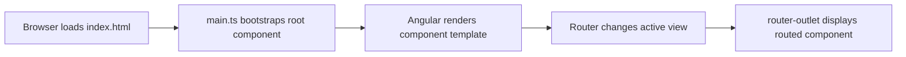
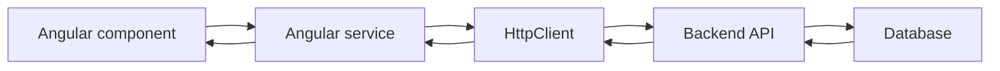

# Angular Interview Preparation Summary

**Source:** Angular Full Course in Hindi transcript

This note summarizes the core Angular topics covered in the lesson and turns them into interview-ready explanations, commands, examples, and comparison points.

## 1. What Is Angular?

Angular is a TypeScript-based web framework for building structured, scalable client-side applications. It is commonly used to build single-page applications (SPAs), where navigation updates the displayed view without reloading the entire HTML document.

### Why Use Angular?

- Component-based architecture
- Built-in routing
- TypeScript support
- Dependency injection
- Forms and validation
- HTTP client for API integration
- Template syntax and data binding
- Services for reusable logic
- Lifecycle hooks
- Pipes for formatting
- Signals for reactive state management

### SPA Flow



## 2. Setup and CLI Commands

Angular applications require Node.js and npm. The Angular CLI provides commands for creating and managing Angular projects.

```bash
node --version
npm --version
npm install -g @angular/cli
ng version
ng new demo
cd demo
ng serve
```

Open the local application at `http://localhost:4200`.

Useful commands:

```bash
ng serve --port 4209
ng generate component components/user
ng generate service services/video
ng generate component data-binding
```

Short forms are also available:

```bash
ng g c components/user
ng g s services/video
```

### Typical Project Files

| File or folder | Purpose |
| --- | --- |
| `package.json` | Dependencies, scripts, and project metadata |
| `angular.json` | Angular workspace and build configuration |
| `src/main.ts` | Application bootstrap entry point |
| `src/app/` | Application components and feature code |
| `src/styles.css` | Global styles |
| `public/` | Public static assets |
| `node_modules/` | Installed npm packages |
| `tsconfig.json` | TypeScript configuration |

## 3. Angular Architecture

Angular applications are built from components. A component commonly contains:

```text
user/
├── user.ts       Component class and logic
├── user.html     Template
├── user.css      Component styles
└── user.spec.ts  Tests
```

The component class contains TypeScript logic, the HTML file defines the view, and the CSS file defines component-specific styling.

In modern Angular versions, standalone components are common. A standalone component manages its own imports and does not need to be declared in an NgModule in the traditional way.

### Component Decorator Example

```typescript
import { Component } from '@angular/core';

@Component({
  selector: 'app-user',
  standalone: true,
  templateUrl: './user.html',
  styleUrl: './user.css'
})
export class UserComponent {
  name = 'Angular';
}
```

Use the selector in another component after importing the component:

```html
<app-user></app-user>
```

## 4. Components and Selectors

A component is a reusable UI unit. It can represent a page, form, table, card, navigation area, or shared widget.

The selector is the unique HTML-like name used to render the component.

```typescript
@Component({
  selector: 'app-admin',
  template: '<p>Admin works!</p>'
})
export class AdminComponent {}
```

```html
<app-admin></app-admin>
```

### Interview Point

Creating a component is not enough to display it. It must be:

1. Imported into the consuming standalone component.
2. Added to the consuming component's `imports` array.
3. Rendered using its selector, or configured as a route.

## 5. Routing and Navigation

Routing provides multi-page navigation behavior inside a single-page application. Angular changes the active component without reloading the complete document.

### Route Configuration

```typescript
import { Routes } from '@angular/router';
import { UserComponent } from './components/user/user';
import { AdminComponent } from './components/admin/admin';

export const routes: Routes = [
  { path: 'user', component: UserComponent },
  { path: 'admin', component: AdminComponent },
  { path: '', redirectTo: 'user', pathMatch: 'full' }
];
```

### Router Outlet and Router Link

```html
<nav>
  <a routerLink="/user">User</a>
  <a routerLink="/admin">Admin</a>
</nav>

<router-outlet></router-outlet>
```

- `routerLink` changes the route.
- `router-outlet` is the placeholder where the active routed component is rendered.

### Interview Questions

**Why is `router-outlet` required?**

It marks the location in the template where Angular inserts the component selected by the current route.

**Why use Angular routing instead of normal links?**

Angular routing preserves the SPA experience and avoids a full browser page reload.

## 6. Data Binding

Data binding connects component data and template UI.

### Interpolation

Displays a component value in the template.

```typescript
courseName = 'Angular';
```

```html
<h2>{{ courseName }}</h2>
```

### Property Binding

Sends a component value to an element property.

```typescript
courseName = 'Angular';
```

```html
<input [value]="courseName">
<button [disabled]="isSaving">Save</button>
```

### Event Binding

Sends a user event from the template to the component.

```typescript
showMessage(): void {
  alert('Welcome to Angular');
}
```

```html
<button (click)="showMessage()">Show message</button>
```

### Two-Way Binding

Synchronizes a component value and form control in both directions.

```typescript
courseName = 'Angular';
```

```html
<input [(ngModel)]="courseName">
<p>{{ courseName }}</p>
```

For standalone components, import `FormsModule` when using `ngModel`.

### Binding Summary

| Binding | Direction | Syntax | Use |
| --- | --- | --- | --- |
| Interpolation | Component to template | `{{ value }}` | Display text |
| Property binding | Component to element property | `[value]="value"` | Set dynamic properties |
| Event binding | Template to component | `(click)="method()"` | Handle events |
| Two-way binding | Both directions | `[(ngModel)]="value"` | Synchronize form values |

## 7. Control Flow

Modern Angular supports built-in control-flow blocks such as `@if`, `@else`, and `@for`.

### Conditional Rendering

```typescript
isVisible = true;
```

```html
<button (click)="isVisible = !isVisible">Toggle</button>

@if (isVisible) {
  <p>The content is visible.</p>
} @else {
  <p>The content is hidden.</p>
}
```

### Looping Through Data

```typescript
cities = ['Pune', 'Mumbai', 'Jalna', 'Jaipur'];
```

```html
<ul>
  @for (city of cities; track city) {
    <li>{{ city }}</li>
  }
</ul>
```

### Object List Example

```typescript
students = [
  { name: 'Asha', city: 'Pune', active: true },
  { name: 'Ravi', city: 'Mumbai', active: false }
];
```

```html
<table>
  @for (student of students; track student.name; let index = $index) {
    <tr>
      <td>{{ index + 1 }}</td>
      <td>{{ student.name }}</td>
      <td>{{ student.city }}</td>
      <td>
        @if (student.active) {
          Active
        } @else {
          Inactive
        }
      </td>
    </tr>
  }
</table>
```

### Interview Point

Older Angular applications commonly use `*ngIf` and `*ngFor`. Angular's newer control-flow syntax uses `@if`, `@else`, and `@for`. Know both when working with existing projects.

## 8. Forms

Angular supports two major form approaches.

### Template-Driven Forms

Template-driven forms use directives in the HTML template and are suitable for simple forms.

```typescript
import { FormsModule } from '@angular/forms';

courseName = '';
```

```html
<form #courseForm="ngForm">
  <input name="courseName" [(ngModel)]="courseName" required>
  <button [disabled]="courseForm.invalid">Save</button>
</form>
```

### Reactive Forms

Reactive forms define form structure and validation in TypeScript. They are better for complex, dynamic, or strongly controlled forms.

```typescript
import { FormControl, FormGroup, ReactiveFormsModule } from '@angular/forms';

videoForm = new FormGroup({
  title: new FormControl(''),
  description: new FormControl(''),
  duration: new FormControl('')
});

save(): void {
  console.log(this.videoForm.value);
}
```

```html
<form [formGroup]="videoForm" (ngSubmit)="save()">
  <input formControlName="title">
  <textarea formControlName="description"></textarea>
  <input formControlName="duration">
  <button type="submit">Save</button>
</form>
```

### Template-Driven vs Reactive Forms

| Feature | Template-driven | Reactive |
| --- | --- | --- |
| Main definition | HTML template | TypeScript class |
| Best for | Small forms | Complex and dynamic forms |
| Validation | Mostly template directives | Programmatic and explicit |
| Testing | More dependent on template | Easier to test as model |
| Module | `FormsModule` | `ReactiveFormsModule` |

## 9. API Integration

An Angular application normally communicates with a backend through an API instead of connecting directly to the database.



### Configure HttpClient

In a standalone application, provide the HTTP client in the application configuration:

```typescript
import { provideHttpClient } from '@angular/common/http';

export const appConfig = {
  providers: [provideHttpClient()]
};
```

### Basic GET Request

```typescript
import { HttpClient } from '@angular/common/http';
import { Injectable, inject } from '@angular/core';

@Injectable({ providedIn: 'root' })
export class UserService {
  private http = inject(HttpClient);
  private apiUrl = 'https://api.example.com/users';

  getUsers() {
    return this.http.get(this.apiUrl);
  }
}
```

Consume the service from a component:

```typescript
users: User[] = [];
private userService = inject(UserService);

loadUsers(): void {
  this.userService.getUsers().subscribe(result => {
    this.users = result;
  });
}
```

### HTTP Operations

| Method | Common operation |
| --- | --- |
| `GET` | Read records |
| `POST` | Create a record |
| `PUT` or `PATCH` | Update a record |
| `DELETE` | Delete a record |

Always handle loading, success, and error states in production code.

## 10. Services and Dependency Injection

A service holds reusable logic that should not be duplicated across components. API calls, shared state, business rules, and utility operations commonly belong in services.

Create one with:

```bash
ng generate service services/video
```

Inject it with the modern `inject()` function:

```typescript
private videoService = inject(VideoService);
```

Or use constructor injection:

```typescript
constructor(private videoService: VideoService) {}
```

### Why Use Services?

- Avoid duplicate code
- Separate UI from business logic
- Reuse API calls
- Improve testability
- Share state or behavior
- Keep components smaller

## 11. Lifecycle Hooks

Lifecycle hooks run at specific stages of a component's existence. `ngOnInit` is commonly used for initialization and initial API calls.

```typescript
import { Component, OnInit } from '@angular/core';

export class UserComponent implements OnInit {
  ngOnInit(): void {
    this.loadUsers();
  }

  private loadUsers(): void {
    // Load initial component data.
  }
}
```

### Important Lifecycle Hooks

| Hook | When it runs | Typical use |
| --- | --- | --- |
| `ngOnChanges` | When an input value changes | React to parent data changes |
| `ngOnInit` | Once after initial inputs | Initialization and initial API calls |
| `ngAfterViewInit` | After the view is initialized | Access view-related behavior |
| `ngOnDestroy` | Before component destruction | Cleanup subscriptions and resources |

### Interview Question

**Why should an API call often be placed in `ngOnInit` instead of the constructor?**

The constructor is intended for dependency setup. `ngOnInit` is the lifecycle phase intended for initialization logic after Angular has initialized the component's inputs.

## 12. Pipes

A pipe transforms data for display without changing the original component value.

```html
<p>{{ name | uppercase }}</p>
<p>{{ name | lowercase }}</p>
<p>{{ description | slice:0:50 }}</p>
<pre>{{ student | json }}</pre>
```

Common built-in pipes include:

- `uppercase`
- `lowercase`
- `titlecase`
- `date`
- `currency`
- `percent`
- `slice`
- `json`

Use pipes for presentation formatting. Keep business logic out of templates and pipes when it belongs in a service or component model.

## 13. Parent-Child Communication

### Parent to Child with `@Input`

The parent sends data to the child through an input property.

```typescript
import { Component, input } from '@angular/core';

export class AlertComponent {
  message = input('');
}
```

```html
<app-alert [message]="successMessage"></app-alert>
```

The classic decorator syntax is also common in existing Angular projects:

```typescript
@Input() message = '';
```

### Child to Parent with `@Output`

The child emits an event that the parent handles.

```typescript
import { EventEmitter, Output } from '@angular/core';

@Output() closed = new EventEmitter<string>();

close(): void {
  this.closed.emit('Alert closed');
}
```

```html
<app-alert (closed)="handleClosed($event)"></app-alert>
```

### Interview Summary

- `Input`: parent to child data flow
- `Output`: child to parent event flow
- Shared service: communication between unrelated components

## 14. Signals

A signal is a reactive value that notifies Angular when its value changes. Signals are useful for local reactive state.

```typescript
import { signal } from '@angular/core';

courseName = signal('Angular');

changeCourse(): void {
  this.courseName.set('TypeScript');
}
```

Read a signal by calling it:

```html
<p>{{ courseName() }}</p>
<button (click)="changeCourse()">Change</button>
```

Common signal operations:

- `signal(initialValue)` creates a writable signal.
- `signal()` reads the current value.
- `.set(value)` replaces the value.
- `.update(value => ...)` derives a new value from the current value.
- `computed()` creates derived read-only state.
- `effect()` runs side-effect logic when dependencies change.

## 15. Classes and Interfaces

Use an interface to describe the shape of data:

```typescript
export interface Video {
  videoId: number;
  title: string;
  description: string;
  duration: string;
}
```

Use the interface in services and components:

```typescript
videos: Video[] = [];
```

A class can contain both data and behavior, while an interface primarily defines a compile-time contract.

## 16. Interview Comparison Questions

### Component vs Service

| Component | Service |
| --- | --- |
| Controls a UI view | Holds reusable logic or data access |
| Uses a template | Usually has no template |
| Handles user interaction | Handles API calls and business logic |
| Short-lived with view lifecycle | Can be shared through dependency injection |

### `ngModel` vs Reactive Forms

`ngModel` is convenient for simple template-driven forms. Reactive forms provide explicit TypeScript control and are usually preferred for complex forms, dynamic controls, and large applications.

### Property Binding vs Interpolation

Interpolation is mainly for displaying text. Property binding sets a DOM or component property and is appropriate for values such as `[disabled]`, `[value]`, `[src]`, and `[class]`.

### `@Input` vs `@Output`

`@Input` passes data into a child. `@Output` emits an event from a child to its parent.

### Constructor vs `ngOnInit`

Use the constructor for dependency injection and basic setup. Use `ngOnInit` for initialization logic that depends on initialized inputs or component state.

## 17. Common Interview Questions

1. What is Angular and why is it used?
2. What is a single-page application?
3. What is the role of `main.ts`?
4. What is the purpose of `angular.json`?
5. What is a component?
6. What is a standalone component?
7. What is a selector?
8. What is `router-outlet`?
9. Explain interpolation, property binding, event binding, and two-way binding.
10. What is the difference between template-driven and reactive forms?
11. Why should API calls be placed in services?
12. What is dependency injection?
13. Explain `ngOnInit` and `ngOnDestroy`.
14. What is a pipe?
15. How does parent-child communication work?
16. What are signals?
17. What is the difference between a class and an interface?
18. How do you implement CRUD operations with `HttpClient`?
19. Why should an application use an API instead of connecting directly to a database?
20. How do modern `@if` and `@for` blocks compare with older structural directives?

## 18. A Small Interview Project Flow

A practical Angular CRUD project can be explained in this order:

```text
Create project
    -> Create feature component
    -> Add route and navigation
    -> Build template or reactive form
    -> Define model/interface
    -> Create service
    -> Configure HttpClient
    -> Implement GET, POST, PUT, DELETE
    -> Display loading and error states
    -> Test the complete user flow
```

For a video-management screen:

- GET loads the video list.
- POST creates a new video.
- PUT updates the selected video.
- DELETE removes a video after confirmation.
- A service owns the API methods.
- The component owns view state and form interaction.
- A model or interface describes the video object.

## Final Revision Checklist

Before an Angular interview, be able to explain and demonstrate:

- Angular CLI setup and project structure
- Components and standalone imports
- Routing, `routerLink`, and `router-outlet`
- All four types of data binding
- `@if`, `@else`, and `@for`
- Template-driven and reactive forms
- `HttpClient` and CRUD operations
- Services and dependency injection
- Lifecycle hooks
- Built-in pipes
- Input/output communication
- Signals and reactive state
- Interfaces, classes, and typed API models
- Loading, error, validation, and cleanup practices
