# Azure Interview Cheat Sheet
## Detailed Answers with Graphical Examples for .NET Developers

> This guide is designed for interview preparation and practical understanding of Azure services, architecture, and real-world .NET application design.

---

## 1) Azure Fundamentals: Core Concepts

### What is Microsoft Azure?
Azure is Microsoft’s cloud platform that provides on-demand computing, storage, networking, databases, AI, and security services.

Typical use cases:
- Host web apps and APIs
- Run background jobs and functions
- Store data in relational or NoSQL databases
- Secure identity and access
- Build data pipelines and analytics
- Deploy containerized applications

### Azure service categories

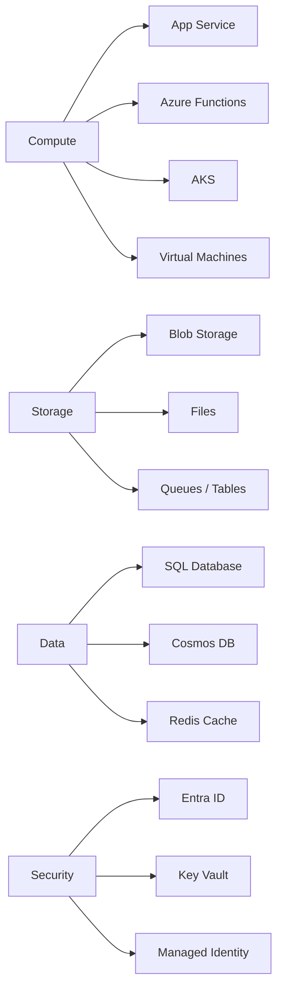

### Example: Why use Azure App Service?
A .NET Web API can be deployed to Azure App Service without managing VMs.

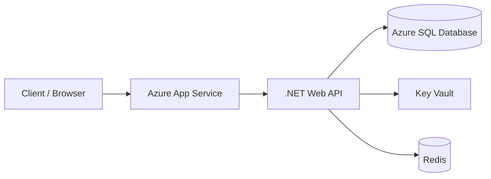

When to use it:
- Quickly deploy web apps and APIs
- Auto-scaling and managed platform
- Great for .NET Core / ASP.NET Core applications

---

## 2) Azure Compute Services

### Azure App Service vs Azure Functions vs VM

| Service | Best for | Scaling | Management |
|---|---|---:|---|
| Azure App Service | Web apps, APIs, MVC apps | Vertical / Horizontal | Managed |
| Azure Functions | Event-driven code, serverless tasks | Automatic | Managed |
| Virtual Machines | Custom operating systems, legacy apps | Manual / VM scale sets | User-managed |

### Example architecture

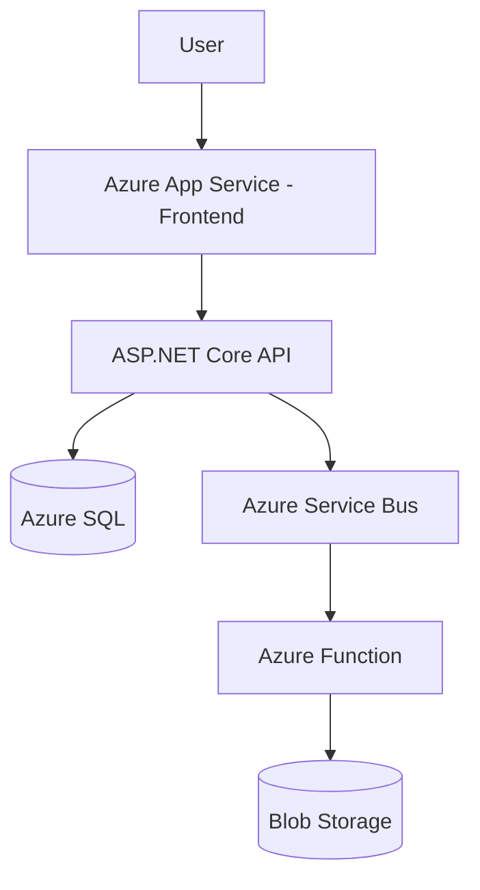

### Interview answer example
"I would choose Azure App Service for a .NET web application because it is a fully managed platform, supports deployment slots, scaling, and integrates well with CI/CD. For asynchronous workloads like email processing, I would use Azure Functions or Service Bus."

---

## 3) Azure Storage Options

### Storage types

| Service | Purpose | Good for |
|---|---|---|
| Blob Storage | Unstructured data | Images, logs, backups, media |
| File Storage | Shared file system | Lift-and-shift workloads |
| Queue Storage | Messaging | Decoupling services |
| Table Storage | NoSQL key-value | Fast lightweight storage |
| Disk Storage | VM disks | Databases and OS disks |

### Example scenario
A .NET application uploads invoices and generates PDFs:

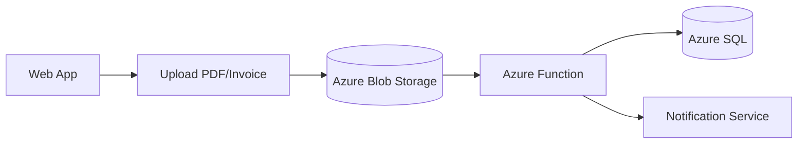

### Interview answer example
"Blob Storage is the best choice for large files or media because it is cheap, scalable, and optimized for object storage. I would use Queue Storage to decouple upload processing from the main API flow."

---

## 4) Azure SQL Database vs SQL Server on VM

### Key differences

| Option | Use case | Management | Cost model |
|---|---|---|---|
| Azure SQL Database | Modern PaaS database | Fully managed | Pay-as-you-go |
| SQL Server on VM | Legacy or custom SQL server requirements | User-managed | VM + SQL license |

### Example
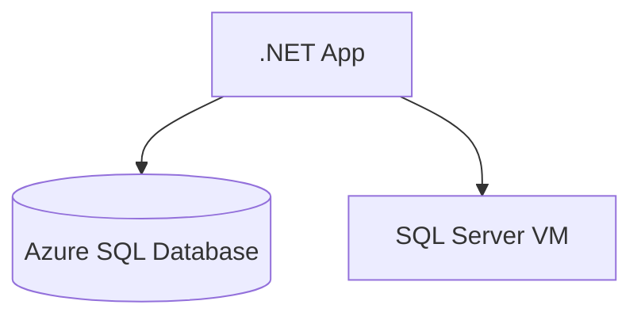

### When to choose what?
- Use Azure SQL Database when you want a managed relational database with backups, patching, and high availability built in.
- Use SQL Server on VM when you need full OS or SQL server control, custom configuration, or compatibility with legacy apps.

---

## 5) Azure Identity and Authentication

### Azure AD / Microsoft Entra ID
Entra ID is Microsoft’s identity platform for managing users, groups, applications, and access.

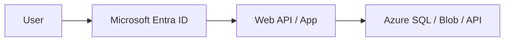

### Common patterns
- OAuth 2.0 / OpenID Connect for web apps
- Managed Identity for service-to-service auth
- App roles and groups for RBAC

### Example for .NET app
```csharp
builder.Services.AddAuthentication(JwtBearerDefaults.AuthenticationScheme)
    .AddJwtBearer(options =>
    {
        options.Authority = "https://login.microsoftonline.com/{tenantId}";
        options.Audience = "api://your-api-client-id";
    });
```

### Managed Identity example
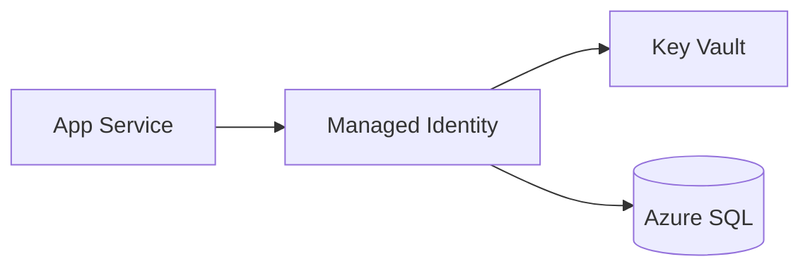

### Interview answer example
"For secure service-to-service communication, I prefer Managed Identity because the app authenticates to Azure resources without embedding secrets in configuration files."

---

## 6) Azure App Service and Deployment

### Typical .NET deployment flow

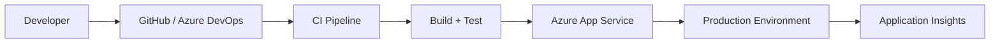

### Common .NET deployment choices
- Azure App Service for web apps and APIs
- Deployment slots for staging and production
- App Settings and Connection Strings for configuration
- App Insights for observability

### Example architecture
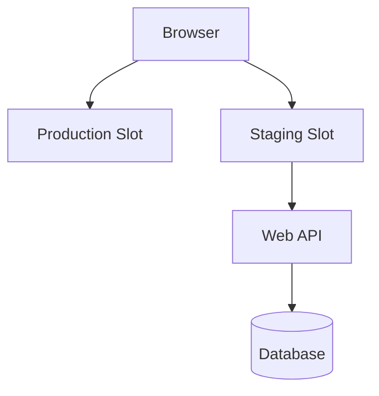

---

## 7) Azure Database and Best Practices

### Azure SQL Database best practices
- Use connection pooling
- Keep queries efficient and indexed
- Use elastic pools for small/medium workloads
- Enable diagnostics and alerts
- Avoid opening connections in tight loops

### Example with a .NET API
```csharp
builder.Services.AddDbContext<AppDbContext>(options =>
    options.UseSqlServer(builder.Configuration.GetConnectionString("DefaultConnection")));
```

### Architecture example
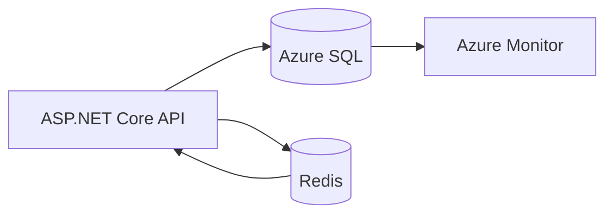

### Interview answer example
"For a .NET application, I would keep the relational database in Azure SQL Database, use Redis for caching frequently accessed data, and ensure the application uses connection pooling and proper indexing."

---

## 8) Azure Cache for Redis

### Why use Redis?
Redis is used to speed up application performance by caching data and reducing database load.

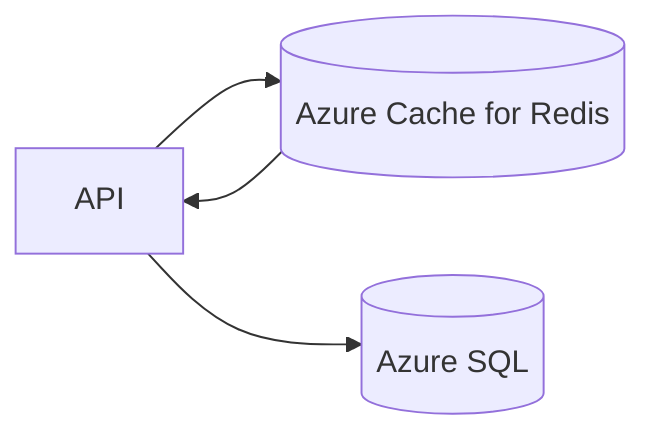

### Typical usage
- Session storage
- Frequently accessed lookup tables
- Rate limiting data
- Distributed caching across app instances

### Example
```csharp
var cacheKey = "product:123";
var product = await cache.GetStringAsync(cacheKey);
if (string.IsNullOrEmpty(product))
{
    product = await db.Products.FindAsync(123);
    await cache.SetStringAsync(cacheKey, product, TimeSpan.FromMinutes(10));
}
```

---

## 9) Azure Key Vault and Secrets Management

### Why Key Vault matters
It stores secrets, certificates, and encryption keys securely and avoids hardcoding credentials in code or config files.

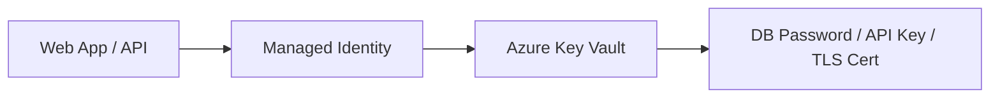

### Best practices
- Store secrets only in Key Vault
- Use Managed Identity instead of access keys
- Keep least privilege access
- Rotate secrets regularly

---

## 10) Azure Monitoring and Diagnostics

### Tools to monitor Azure apps
- Azure Monitor
- Application Insights
- Log Analytics
- Alerts and action groups

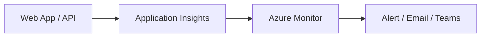

### Common issues to diagnose
- High latency
- Failed requests
- Dependency failures
- Exceptions and memory spikes

### Example interview answer
"I would use Application Insights to monitor request rates, failures, response times, and dependency calls. For infrastructure health, I would use Azure Monitor and set alerts on CPU, memory, and failed requests."

---

## 11) Junior-Level Interview Q&A

### Q1: What is Azure?
Azure is Microsoft’s cloud platform offering compute, storage, networking, databases, AI, and security services.

### Q2: What are the major Azure services?
Examples:
- App Service: hosting web apps
- Azure SQL: managed relational database
- Blob Storage: file/object storage
- Entra ID: authentication and identity
- Functions: serverless code execution

### Q3: Why use Azure App Service?
To host .NET web apps quickly, with built-in scaling and deployment support.

### Q4: What is Azure Functions?
A serverless compute service used for background tasks, HTTP triggers, event processing, and integration jobs.

### Q5: What is Azure SQL Database?
A managed relational database in Azure with backups, security, scaling, and high availability.

---

## 12) Mid-Level Interview Scenarios

### Scenario: Build a secure .NET app on Azure

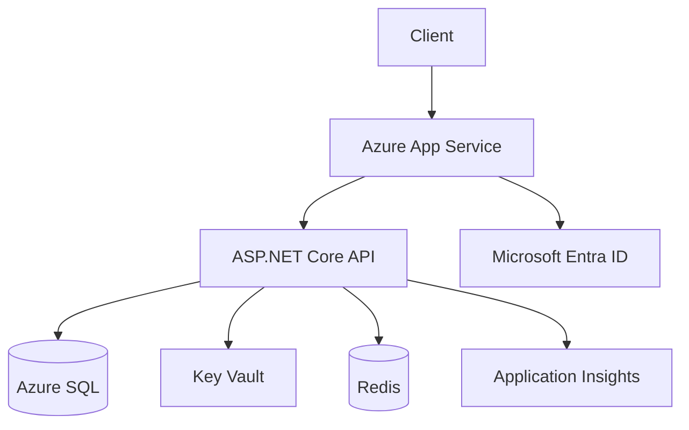

### How I would design it
1. Use Azure App Service to host the API
2. Configure Entra ID for authentication
3. Store secrets in Key Vault
4. Use Azure SQL for persistence
5. Use Redis for repetitive read-heavy data
6. Monitor using Application Insights

---

## 13) Senior-Level Architecture Topics

### Example: Multi-tier .NET application on Azure

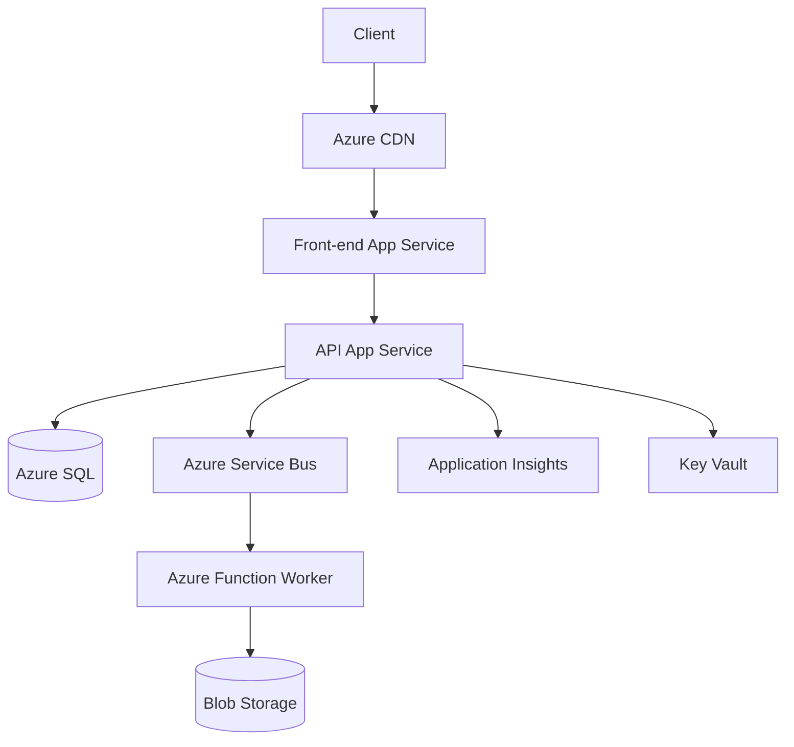

### Key architecture considerations
- Use stateless services
- Separate compute, data, and messaging layers
- Add autoscaling and load balancing
- Use managed services to reduce ops overhead
- Implement tracing, telemetry, and resilience patterns

### Trade-offs and design decisions
- App Service is simpler, Functions are event-driven and cheaper for burst workloads
- SQL is consistent and reliable, while Cosmos DB is better for highly distributed NoSQL data
- AKS gives more control, but requires more operational effort

---

## 14) Common Azure Interview Answer Template

Use this structure in interviews:

1. State the requirement clearly
2. Explain the Azure service chosen
3. Mention alternatives considered
4. Explain security and scaling concerns
5. Describe monitoring and operational readiness

### Example answer template
"For this requirement, I would use Azure App Service for hosting, Azure SQL Database for persistence, Key Vault for secrets, and Application Insights for monitoring. I chose this because it reduces operational overhead while still supporting secure deployment, autoscaling, and easier CI/CD integration."

---

## 15) Quick Revision Map

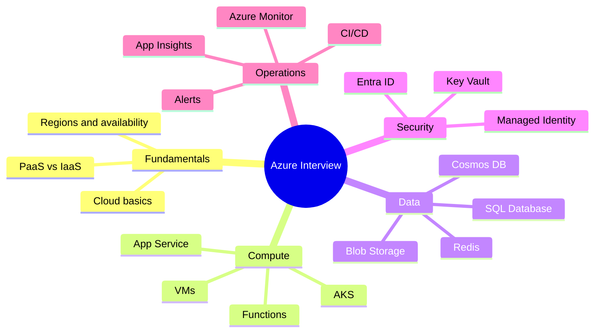

---

## 16) Final Interview Tips

- Speak in terms of business requirement first, then Azure service choice
- Explain why a service is chosen, not just what it is
- Mention security and cost-conscious design
- Show awareness of monitoring, scaling, and resilience
- Use practical .NET examples in answers

---

## 17) 1-Minute Summary

Azure is best understood through real-world system design:
- Frontend: App Service / static web apps
- API: ASP.NET Core on App Service or Functions
- Database: Azure SQL / Cosmos DB
- Secrets: Key Vault
- Identity: Microsoft Entra ID
- Monitoring: Application Insights + Azure Monitor
- Messaging: Service Bus / Queue Storage

This is the pattern most .NET Azure interviews expect you to explain clearly and confidently.

---

## 18) Bonus: Example Interview Response

> “If I were designing a .NET e-commerce application on Azure, I would deploy the frontend and API to Azure App Service, use Azure SQL Database for transactional data, Redis for product catalog caching, Service Bus for order processing, and Azure Functions for asynchronous workflows such as email notifications. I would secure secrets using Key Vault and configure Microsoft Entra ID for user authentication. For observability, I would use Application Insights and Azure Monitor with alerts for errors, latency, and dependency failures.”

---

## 19) Useful Interview References

- Azure App Service
- Azure Functions
- Azure SQL Database
- Azure Blob Storage
- Azure Key Vault
- Azure Monitor
- Application Insights
- Microsoft Entra ID
- Azure Service Bus
- Azure Cache for Redis

This document can be used as both a quick-revision sheet and a deeper-practice guide before interviews.
