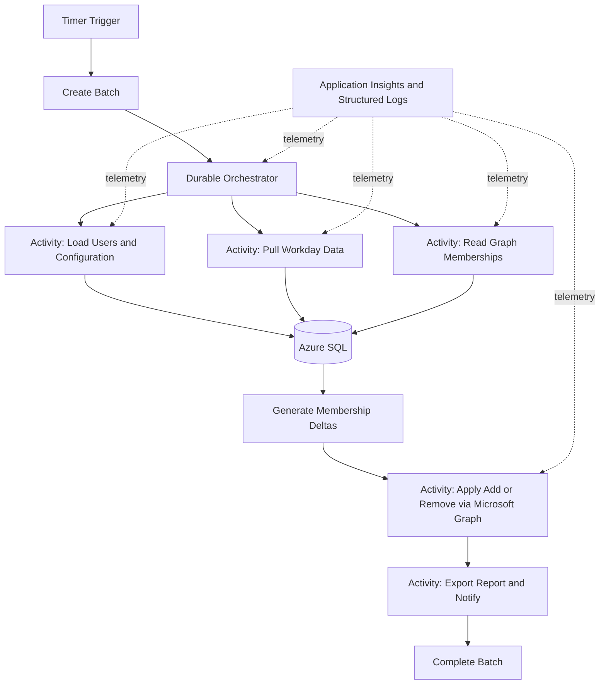

# KHC DDL Automation: 10+ Years .NET and Cloud-Native Interview Q&A

This guide is based on [KHC_DDL_Automation_Interview_QA_Updated_With_Diagrams.md](KHC_DDL_Automation_Interview_QA_Updated_With_Diagrams.md). It expands that project narrative into senior .NET, Azure, distributed-systems, data, security, operations, and leadership questions.

Treat the answers as interview starting points. The source describes the project as .NET 8 Azure Durable Functions integrating Workday, Microsoft Graph/Azure AD, SharePoint Online, and Azure SQL, with batch processing, delta generation, reporting, and Application Insights. It does not state every implementation or operational detail. Replace bracketed items and qualify anything about hosting, delivery, scale, identity, testing, or outcomes that you cannot verify from your own experience.

## Architecture At A Glance

**One-minute project summary:**

"I work on the KHC Distribution List Automation project. It automates synchronization of distribution-list and security-group membership across enterprise systems. Workday provides employee and group inputs, SharePoint provides configuration, Microsoft Graph provides current directory membership and the API for applying changes, and Azure SQL stores processing data and supports delta generation. A timer starts a batch, Azure Durable Functions coordinate the long-running workflow, activities perform individual steps, and the system exports reports and sends notifications. The platform uses .NET 8, Azure Durable Functions, Azure SQL, EF Core, Microsoft Graph, SharePoint Online, and Application Insights. My contribution has included **[state your actual scope]**."

## 1. Project, Architecture, and Senior Ownership

### 1. How would you explain the project to a business stakeholder?

"The project automates the process of keeping distribution lists and security groups aligned with authoritative employee and configuration data. It compares the expected membership with the current directory membership, identifies additions and removals, applies those changes, and records the batch outcome for reporting and support. The business value is less manual administration, more consistent access, and a traceable process."

### 2. Describe the architecture and the role of each component

"A timer trigger starts a batch and a Durable Functions orchestrator coordinates the workflow. Activity functions perform the actual work, such as pulling data from Workday, SharePoint, or Microsoft Graph, persisting and retrieving data through services and Azure SQL, applying membership changes, and exporting reports. The service layer separates integration and business responsibilities, while Application Insights and structured logs provide operational visibility. The orchestrator coordinates; it should not directly perform network or database I/O."

### 3. Walk through one batch end to end

"The scheduled trigger creates a batch record and starts the orchestration. Activities retrieve the relevant users, configuration, expected Workday data, and current directory memberships. Data is stored or staged in Azure SQL, where the comparison logic generates add, remove, and no-change outcomes. Activities apply eligible changes through Microsoft Graph, record per-item outcomes, generate reports, send notifications, and mark the batch complete. I would also explain how the implementation handles partial failure and whether a rerun resumes, retries, or starts a new batch."

### 4. What was your role, and what did you personally deliver?

"My role was **[role]**. I personally owned or contributed to **[specific services, activities, stored procedures, API integrations, tests, monitoring, or production support]**. I worked with **[teammates and partner teams]** on **[shared areas]**. The team delivered **[outcome]**; my individual contribution was **[specific result]**."

Keep individual ownership distinct from team delivery. Be ready to name one design choice, one failure you diagnosed, and one measurable result you can substantiate.

### 5. How do you decide what belongs in an orchestrator, activity, service, and repository?

"The orchestrator owns workflow coordination and durable control flow. Activities are the boundary for work that performs I/O or has side effects. Services encapsulate business or integration operations so they can be reused and tested. A repository or data-access component isolates persistence where it provides a meaningful abstraction. I avoid putting business processing into the orchestrator because it must replay deterministically, and I avoid creating pass-through abstractions that add no value."

### 6. Why use Durable Functions for this workflow?

"The workflow spans several dependent external calls, database operations, and potentially long-running batch steps. Durable Functions provide persisted orchestration state, checkpointing, and restartable coordination, which are useful for long-running workflows. They also make the process easier to inspect than a single in-memory function invocation. The tradeoff is that orchestration replay and versioning rules must be understood, and durable state does not automatically make every activity exactly-once or every external operation idempotent."

### 7. Why use a layered or service-oriented design?

"The system has different reasons to change: workflow coordination, membership rules, vendor integrations, and database persistence. Separating those concerns improves unit testing and lets us change an integration or persistence detail without rewriting the workflow. I use boundaries that isolate real changes; I would not add a layer solely to wrap one method without improving testability, ownership, or change isolation."

### 8. Which design patterns are relevant here?

"The primary pattern is orchestration: a Durable Functions orchestrator coordinates activities. The service layer separates use cases and integrations from orchestration and persistence. Repository-style data access can isolate database operations, although EF Core already provides many repository and unit-of-work capabilities. Dependency Injection supports replaceable implementations and testing. I would describe a pattern only where it is actually present and explain its tradeoff, not just list pattern names."

### 9. How would you define the system's important invariants?

"I would make the invariants explicit: a batch has a traceable lifecycle; each membership decision is based on a defined input snapshot; only authorized and valid changes are applied; each attempted change has an auditable outcome; retries do not create unintended duplicate effects; and a failure is visible rather than silently treated as success. The exact invariants should be agreed with the business and identity/security owners."

### 10. What would you improve in the architecture?

"I would start with evidence from incidents, traces, and query plans rather than proposing a rewrite. Areas I would assess include explicit per-item status and idempotency, bounded concurrency and rate-limit handling for Graph, input snapshot/version tracking, reconciliation and safe reruns, operational dashboards and alerts, contract tests for external integrations, and deployment/rollback automation. I would prioritize by risk and business impact, then introduce changes incrementally behind tests and observable release criteria."

### 11. What tradeoffs exist in putting delta logic in SQL stored procedures?

"Set-based SQL can compare large staged datasets efficiently and reduce data movement into application memory. The tradeoffs are that business rules can become harder to test and version if they are embedded in database code, and application developers need visibility into the stored procedure's behavior. I would keep set-oriented, data-intensive operations in SQL when benchmarks justify it, document the contract, test representative cases, and keep orchestration and cross-system policy understandable in application code."

### 12. How would you measure whether the project is successful?

"I would agree on business and operational measures: batch completion and freshness, number of users and memberships evaluated, successful versus failed changes, unresolved/retried records, duration by workflow stage, Graph throttling and error rates, database query duration, and manual intervention or support volume. I would define targets with stakeholders rather than inventing an SLA, and use historical baselines to verify improvements."

## 2. Durable Functions and Distributed Workflows

### 13. What is the difference between an orchestrator and an activity function?

"An orchestrator describes and coordinates durable workflow steps. It must be deterministic because the runtime can replay it to rebuild state. An activity performs the actual work, such as calling Graph, querying SQL, or generating a report. Activities can be retried according to policy, so side-effecting activities need idempotency or duplicate detection."

### 14. What does deterministic orchestration mean?

"Given the same recorded history, replaying the orchestrator must make the same decisions and schedule the same actions. I do not make direct HTTP or database calls, read the current clock, generate random values, or use non-deterministic APIs in orchestrator code. I obtain time and external data through durable context APIs or activities, and keep I/O in activities."

### 15. What is orchestration replay, and how do you prevent replay-related issues?

"The runtime re-executes orchestrator code against its event history to reconstruct local state. This is replay, not necessarily a repeated execution of completed activities. I keep the orchestrator free of side effects, use replay-safe logging where available, and avoid interpreting repeated orchestrator log lines as repeated business operations. I verify the exact APIs for the Durable Functions programming model used by the application."

### 16. Are Durable Function activities exactly-once?

"No. Durable orchestration tracks progress, but an activity can be retried or its completion can be uncertain around failures. I design side-effecting work to be idempotent: use a stable operation key, persist an outcome before retry where appropriate, check current state before applying a change, and treat an already-achieved desired state as success when the business rules permit. I do not promise exactly-once effects across an external API and SQL without a transaction spanning both, which generally is not available."

### 17. How would you make a batch safe to rerun?

"I would define whether rerun means continue the same orchestration, retry selected failed items, or start a new batch. I would persist batch and item identifiers, input snapshot/version, desired operation, attempt count, and outcome. Before applying a change, I would verify current state or use a deduplication key so a repeated request does not create an unintended effect. I would also keep a clear audit trail between original and retry batches."

### 18. How do you handle retries?

"I classify failures first. Transient network failures, 429 throttling, or selected 5xx responses may be retried with bounded exponential backoff and jitter, honoring `Retry-After` when supplied. Authentication, validation, and permanent business errors should not be retried blindly. Retry policy belongs at the correct boundary and should not multiply across nested layers. For a side-effecting request, the retry is safe only if the operation is idempotent or its outcome can be reconciled."

### 19. How would you handle partial failure in delta execution?

"I would track each membership operation independently instead of treating the entire batch as a single success/failure. Store the requested action, target, attempt, response classification, and final status. Continue processing independent items when policy allows, isolate permanent failures for review, and provide a batch summary that distinguishes complete, partial, and failed outcomes. A retry should target only eligible items and must re-check whether the desired state has already been reached."

### 20. How would you parallelize the workflow safely?

"I would identify independent steps or partitions, then use bounded fan-out/fan-in rather than launching unlimited concurrent calls. The concurrency limit should respect Graph throttling, SQL capacity, memory, and downstream quotas. I would preserve ordering where the business requires it, aggregate item-level failures, and use stable partition keys so work can be retried or diagnosed. I would tune limits with load tests and production telemetry."

### 21. How do you deal with Durable Functions history growth?

"Long-running orchestrations accumulate history. I would inspect history size and replay time, split large work into sub-orchestrations or bounded batches where appropriate, and use `ContinueAsNew` for suitable repeating workflows to reset accumulated history. I would retain business audit data in the application's durable data store rather than relying on orchestration history as the reporting database."

### 22. How do you handle orchestration version changes during deployment?

"I avoid changing the behavior or shape of an in-flight orchestration incompatibly. I identify active instances, use compatible changes or versioned orchestration names, and plan how old instances complete before removing old code. The rollout and migration strategy depends on the Durable Functions runtime and hosting model. I would test upgrades with active orchestration histories in a non-production environment and document the drain or migration plan."

### 23. What is the difference between retrying an activity and compensating a workflow?

"A retry repeats an operation expected to succeed after a transient failure. Compensation is a new business action that counteracts an already-completed action when a later step fails. Many directory membership changes are better handled through reconciliation and explicit corrective deltas than pretending to roll back a distributed transaction. I define compensation rules with the business because reversing a valid completed change may itself be harmful."

### 24. What happens if the timer fires while a previous batch is still running?

"I would define an explicit overlap policy: prohibit overlap, queue the next run, or allow bounded parallel batches if inputs and side effects are isolated. Enforce that policy with a durable lease, batch state constraint, or another reliable coordination mechanism rather than an in-memory flag. I would also account for schedule misfires, duplicate trigger delivery, and a stuck batch, and make the operational recovery path clear."

### 25. How would you cancel or pause a running batch?

"I would support cancellation at a defined safe boundary, persist the requested state, and have the orchestrator check for it between activities or batches. I would avoid abandoning an in-flight external side effect without recording its uncertain outcome. A pause/resume feature needs clear semantics for already-applied items, pending work, expiry, and authorization."

## 3. Microsoft Graph, Workday, and SharePoint Integration

### 26. How do you handle Microsoft Graph throttling?

"I detect 429 responses, honor `Retry-After`, and use bounded backoff with jitter. I reduce unnecessary requests by selecting only needed fields, avoiding repeated lookups, and using supported batch or paging patterns carefully. I apply bounded concurrency and record throttling metrics. A Graph batch request can reduce round trips, but it does not remove service limits or mean every subrequest succeeded."

### 27. How do you handle Graph pagination and large directory reads?

"I follow every `@odata.nextLink` until the result set is complete, without constructing or modifying the opaque continuation URL. I process pages incrementally rather than loading an unbounded directory into memory, request only required properties, and persist progress or staged data in manageable batches. I also consider that a multi-page read may not be a perfectly consistent snapshot if the directory changes during the read."

### 28. How would you secure calls to Graph and Workday?

"I use the least-privilege permissions approved for the workload, secure credentials in a managed secret store, and avoid embedding secrets in code or logs. Where supported by the service and hosting model, managed identity can remove the need to manage a client secret; otherwise, a service principal credential should be rotated and protected. I validate token audience and permissions, separate environments, and audit privileged operations. The actual authentication mechanism should match what the project has configured."

### 29. What is the difference between managed identity and a service principal?

"A service principal is an application's identity in Microsoft Entra ID. A managed identity is a service principal whose credential lifecycle is managed by Azure for a supported Azure resource. Managed identity can reduce secret management when the target service supports it and permissions are configured. It is not automatically available for every external API, so the integration's supported authentication method determines the choice."

### 30. How do you handle duplicate or conflicting user records across systems?

"I define a stable identity key and authoritative source for each field with the business. I normalize identifiers carefully, handle missing or ambiguous mappings explicitly, and avoid matching only on display name or email unless that is a documented unique key. Conflicts should be surfaced as data-quality outcomes rather than silently choosing one record. I would test identity changes, rehires, disabled users, and stale records."

### 31. How do you make integrations resilient to schema or contract changes?

"I isolate external DTOs from internal domain models, validate required fields, tolerate additive fields where appropriate, and fail clearly for incompatible changes. I use contract tests or captured representative payloads, version the integration when the provider supports it, and monitor deserialization and validation failures. I avoid leaking vendor-specific response types throughout the business layer."

### 32. How would you protect the workflow from a slow or unavailable external API?

"Use explicit timeouts and cancellation, bounded concurrency, rate-limit-aware retries, and clear failure classification. Avoid tying up unbounded function workers while waiting on a dependency. Persist enough progress to resume safely, expose dependency health and latency, and decide with the business whether stale data can be used or the batch must stop. A circuit breaker can help prevent repeated calls to a failing dependency, but it must be tuned to the dependency and workflow."

### 33. How do you manage secrets and environment configuration?

"Keep non-secret configuration separate from secrets, use environment-specific configuration and a managed secret store, restrict access through identity and RBAC, and rotate credentials. Never log secret values. Validate required configuration at startup or before processing, and make configuration changes traceable. The exact Azure services and deployment settings should reflect the actual environment."

## 4. Azure SQL, EF Core, and Data Processing

### 34. Why combine EF Core and stored procedures?

"EF Core is productive for typed data access and common persistence operations. Stored procedures and set-based SQL can be effective for high-volume staging, comparison, or bulk transformations where moving all data through application memory would be inefficient. I choose based on measured workload, transaction boundaries, maintainability, and testability, and document which layer owns each rule."

### 35. Why process records in batches, and how do you choose a batch size?

"Batching bounds memory use, transaction size, and retry scope. The source project describes processing in batches of 5,000, but that should be treated as an implementation value to validate, not a universal optimum. I would benchmark representative data and tune based on payload size, SQL latency, Graph limits, function memory, transaction duration, and recovery cost."

### 36. How do you avoid loading a large dataset into memory?

"Project only required columns, filter and aggregate in SQL when that is efficient, use pagination or keyset-based batching, and process results incrementally. For read-only EF Core queries, use no-tracking where appropriate. Avoid materializing an unbounded query with `ToList()` before filtering. I also measure allocations and peak memory under realistic data volumes."

### 37. How do you optimize a slow SQL query?

"I reproduce the query with representative parameters and inspect the actual execution plan, duration, logical reads, and row estimates. I check predicates, joins, data types, parameterization, and whether indexes match the filter and sort patterns. I look for scans, key lookups, spills, implicit conversions, and stale statistics. I change one thing at a time and verify the result on realistic data, including write overhead from added indexes."

### 38. How would you design indexes for membership reconciliation?

"I start from the actual join and filter predicates in the comparison query. Candidate indexes might use the stable user/group keys and include columns required by the query, but the exact key order depends on selectivity and query shape. I check uniqueness and data quality, review the execution plan, and measure both read improvement and write cost. I avoid guessing index definitions without seeing the schema and workload."

### 39. How do you manage transactions across SQL and Microsoft Graph?

"There is no normal atomic transaction spanning Azure SQL and Microsoft Graph. I use a distributed-workflow approach: persist the intended operation and its state, call Graph with idempotency/reconciliation protections, then record the outcome. If the call outcome is ambiguous, query current membership before retrying. I use compensating actions only where business-approved, and make partial completion observable."

### 40. How do you handle SQL concurrency and duplicate batch processing?

"I enforce uniqueness or concurrency rules in the database where possible, use optimistic concurrency or appropriate locking for shared state, and ensure batch creation is idempotent for a schedule/run key. I define isolation and transaction scope based on the operation. I do not rely only on application-level checks that can race between workers."

### 41. How would you evolve the database schema safely?

"Use backward-compatible expand-and-contract changes when application and database versions may overlap: add the new schema, deploy code that supports both shapes, backfill if needed, then remove obsolete fields after all consumers move. Run migrations through a controlled release process, test them on representative data, and have a backup and recovery plan. The exact pipeline for this project should be stated accurately."

## 5. .NET 8 and Application Design

### 42. How do Dependency Injection lifetimes affect this application?

"Transient creates an instance per resolution, scoped creates one per scope, and singleton lasts for the host lifetime. I choose based on state and resource ownership. A `DbContext` should not be shared concurrently and generally belongs to a bounded scope. A singleton must be thread-safe and must not capture a shorter-lived scoped service. In Azure Functions, I verify how the chosen hosting model creates scopes rather than assuming ASP.NET request semantics."

### 43. How do you use `IHttpClientFactory` for integrations?

"I use a named or typed client configured through `IHttpClientFactory` so handler lifetimes and configuration are managed centrally. I set base address, default headers only when appropriate, timeouts, and resilience behavior. I avoid creating a new raw `HttpClient` for every request or keeping a manually managed client with stale DNS behavior. I also propagate cancellation and avoid logging authorization headers or sensitive payloads."

### 44. How do async and cancellation work in a function workflow?

"I use asynchronous APIs for I/O and propagate `CancellationToken` through application, database, and HTTP calls where supported. I avoid blocking with `.Result` or `.Wait()`, which can waste threads and cause deadlocks in some contexts. Cancellation should stop work at safe points, but it does not undo a side effect that has already reached an external service; that outcome must be recorded or reconciled."

### 45. How do you handle exceptions in a batch system?

"I classify errors into transient, permanent, validation/data-quality, and unexpected categories. I handle expected outcomes explicitly and let centralized boundaries log unexpected failures with correlation context and a safe error response or failed activity status. I preserve the original exception and useful metadata, avoid swallowing exceptions, and avoid logging secrets or excessive personal data. At item level, I record failures without losing the batch's ability to report partial outcomes."

### 46. How do you prevent memory leaks or excessive memory usage in .NET?

"Managed memory is reclaimed by the garbage collector when objects are no longer reachable, but large retained object graphs, static caches, event subscriptions, and long-lived tracked EF entities can increase memory use. I process bounded batches, use no-tracking reads where suitable, release unmanaged resources with `using`/`Dispose`, and profile allocation and heap behavior under load. I do not force garbage collection as a routine performance fix."

### 47. What are nullable reference types, and why enable them?

"Nullable reference types add compile-time analysis that distinguishes a reference intended to be non-null from one that may be null. They help make API and domain contracts explicit and reduce null-reference defects. They do not change runtime behavior or guarantee that external input is valid, so deserialization and integration boundaries still need validation."

### 48. How do you balance interfaces, repositories, and direct EF Core use?

"I introduce interfaces where they define a meaningful boundary, such as an external integration or a business capability that needs substitution in tests. I do not automatically wrap every EF Core operation in a generic repository because `DbContext` already supplies unit-of-work and repository-like behavior. For complex queries, a focused query service can be clearer than a generic abstraction."

## 6. Cloud-Native Architecture and Operations

### 49. What makes this solution cloud-native?

"It uses managed Azure capabilities, event/schedule-driven execution, distributed workflow state, externalized integrations, and cloud monitoring. The workflow can scale across activity work and recover from interruptions. Cloud-native is not simply 'hosted in Azure'; it also requires good failure isolation, automation, security, observability, and cost-aware scaling. I would describe the actual hosting plan and state provider only after verifying them."

### 50. Which Azure Functions hosting plan would you choose?

"I would compare expected workload duration and frequency, cold-start sensitivity, scale behavior, networking requirements, memory/CPU needs, deployment constraints, and cost. Consumption-style plans can suit intermittent event-driven workloads, while Premium or other plans may fit predictable performance, networking, or longer-running requirements. The Durable Functions capabilities and limits vary by runtime and plan, so I would validate current platform constraints and benchmark the actual workload rather than choosing by habit."

### 51. How would you design for availability and disaster recovery?

"First identify critical dependencies and define recovery time and recovery point objectives with the business. Then assess regional deployment, storage and SQL recovery capabilities, external identity and API dependencies, backup retention, and how orchestration state is restored. A region-level failover plan must account for in-flight workflows and duplicate side effects, not just restarting compute. I would test recovery through exercises and document the runbook."

### 52. How do you control cloud cost for this workload?

"I measure cost by batch and major resource: function execution, orchestration state/history, SQL compute and storage, telemetry ingestion, and external API usage. I reduce unnecessary reads and retries, bound concurrency, retain only useful telemetry, and tune compute after load testing. I preserve enough logging and audit history for security and support; cost optimization should not make failures invisible."

### 53. What should a deployment pipeline include?

"A mature pipeline restores and builds the solution, runs unit and integration tests, performs static analysis and dependency/security checks, packages an immutable artifact, and deploys it through environment-specific approvals and configuration. Database changes need an explicit migration step. After deployment, run health and workflow smoke checks, monitor error and latency signals, and have a tested rollback or roll-forward strategy. I would distinguish the ideal process from what I personally implemented."

### 54. How would you perform a low-risk release?

"I would use backward-compatible changes, staged rollout where the platform supports it, and explicit health gates based on errors, latency, and batch outcomes. I would avoid deploying an incompatible orchestrator change while old instances are active. For risky behavior changes, use a feature flag or controlled batch scope if appropriate. Rollback must consider database compatibility and already-applied directory changes."

### 55. What does observability mean for this system?

"Observability means being able to understand workflow health from correlated logs, metrics, and traces. Each batch and item should have stable identifiers; telemetry should show stage duration, dependency latency, retries, throttling, failures, and counts. Application Insights can provide telemetry, but useful dashboards, alert thresholds, retention, and access controls still need to be designed. I would alert on actionable symptoms such as missed or stuck batches, elevated failed operations, or sustained dependency throttling."

### 56. How would you troubleshoot a batch that is stuck?

"I would start from the batch and orchestration identifiers, inspect current orchestration status and last completed activity, then correlate logs and dependency telemetry. I would determine whether the workflow is waiting, repeatedly retrying, blocked on an external API, or failing to persist progress. Before restarting or terminating it, I would check for in-flight or ambiguous Graph operations and understand the idempotency behavior. Then I would recover using the runbook and record the incident and root cause."

### 57. How do you separate liveness and readiness?

"Liveness asks whether the process is functioning and should remain running; readiness asks whether it can safely accept or start work given required dependencies and configuration. For a scheduled batch worker, readiness may include configuration and required dependency checks, but aggressively failing readiness on a transient external dependency can cause unnecessary restarts. Checks should be lightweight, secure, and aligned with the hosting platform's behavior."

## 7. Security, Governance, and Auditability

### 58. How would you apply least privilege to group membership automation?

"Use a dedicated workload identity with only the permissions needed for the target groups and operations, separate permissions by environment, and restrict who can change configuration or trigger runs. Protect secrets, log administrative changes, validate the requested target group and member, and require an approval or policy gate for especially sensitive groups if the business requires it. Review permissions periodically with the identity/security team."

### 59. How do you audit membership changes?

"Record the batch, source snapshot or version, target group, user identifier, intended action, timestamp, actor/workload identity, result, and a safe error classification. Preserve enough information to answer who or what caused a change and why, without storing unnecessary personal data or credentials. Define retention and access controls, and ensure failed and no-op decisions are distinguishable from successful changes."

### 60. How do you handle sensitive employee data?

"Minimize the fields collected and persisted, restrict access by role, encrypt data in transit and at rest using platform controls, and apply an approved retention period. Avoid putting sensitive values in logs or reports unless there is a clear requirement. I would work with privacy and security stakeholders to confirm data classification, residency, retention, and subject-access requirements."

### 61. How do you defend against bad or malicious configuration?

"Treat configuration as input: validate schema, permitted group identifiers, operation scope, source mappings, and size limits before processing. Restrict who can edit it, audit changes, and consider approval for high-impact changes. A malformed or unexpectedly broad configuration should fail closed or require review rather than triggering large-scale removals."

### 62. How do you approach threat modeling for this system?

"I map trust boundaries among the function app, SQL, Workday, SharePoint, Graph, and operators; identify sensitive data and privileged actions; then consider threats such as stolen credentials, overbroad permissions, malicious configuration, replayed requests, data exfiltration, and denial of service through throttling. I prioritize mitigations such as least privilege, managed identity where applicable, input validation, secret protection, audit logs, rate controls, and incident response testing."

## 8. Testing and Quality

### 63. What testing strategy would you use?

"Use unit tests for pure membership rules and delta decisions, component tests for services with mocked external boundaries, integration tests for SQL mappings and stored procedures, and contract tests for external payload handling. Durable workflow tests should cover orchestration paths and activity outcomes. End-to-end tests should use non-production identities and isolated groups. I would include failure, retry, duplicate, throttling, and partial-completion cases, not only the happy path."

### 64. How do you test a Durable Functions workflow?

"Keep decision logic testable outside the orchestration where practical, and test that the orchestrator schedules the expected activities and responds correctly to their results. Test activities separately with controlled dependencies. In integration tests, verify persistence and failure recovery against the actual runtime/provider where feasible. Avoid tests that depend on timing or live enterprise tenants unless they are intentionally isolated smoke tests."

### 65. How would you test delta-generation correctness?

"Create a truth table for expected and current membership: expected-only means add, current-only means remove, both means no change, and neither is absent. Add cases for duplicates, inactive users, missing identifiers, case/normalization behavior, and conflicting source records. Compare SQL procedure results with a small independently computed expected result, and include realistic volume/performance tests. The exact business rules should be approved before encoding them."

### 66. How do you test resiliency without calling real external systems?

"Wrap external systems behind clients or interfaces and use deterministic fakes for timeouts, 429, 5xx, malformed responses, and ambiguous completion. Verify retry limits, `Retry-After` handling, cancellation, and idempotent outcomes. Add a smaller set of contract or sandbox tests to verify assumptions against the provider without making the full test suite depend on live services."

## 9. Leadership and Senior-Level Judgment

### 67. How do you lead a technical design discussion?

"I clarify the problem, constraints, scale, failure modes, and success criteria first. I present a small number of viable options with tradeoffs, security and operational consequences, and migration cost. I invite feedback from the people who own affected systems, record the decision and unresolved risks, and revisit it if production evidence changes the assumptions."

### 68. How do you handle disagreement about an architecture decision?

"I make the disagreement concrete: what requirement or risk is each option optimizing for? We compare evidence, constraints, and reversibility, then choose the smallest experiment or benchmark that can resolve uncertainty. If a decision remains, I document the rationale and support the agreed direction while keeping the option to revisit it based on measurable outcomes."

### 69. How do you mentor engineers on a system like this?

"I explain the workflow boundaries and invariants, pair on one end-to-end change, and teach how to trace a batch through logs and durable state. I review for correctness, idempotency, test coverage, security, and operational support rather than style alone. I give ownership progressively and make runbooks and design decisions accessible so knowledge is not concentrated in one person."

### 70. Tell me about a production incident and what you learned

"Use a real incident and structure it as context, impact, diagnosis, action, and prevention. Explain how you established the facts from telemetry, what immediate mitigation was safe, and how you restored service. Then describe the root cause and follow-up that reduced recurrence, such as better idempotency, alerting, tests, or runbook changes. Do not invent impact numbers or claim sole ownership when it was a team response."

### 71. How do you prioritize technical debt against feature delivery?

"I translate technical debt into risk or cost: incident likelihood, change lead time, security exposure, operational burden, or cloud spend. I prioritize debt that threatens correctness or safe delivery, and I propose incremental work with a measurable outcome. I make tradeoffs visible to product and engineering stakeholders instead of treating all refactoring as equally urgent."

### 72. How do you use AI tools in senior engineering work?

"I use approved AI tools for bounded tasks such as exploring unfamiliar code, drafting test cases, or comparing implementation options. I verify correctness, security, licensing and data-handling rules, and maintainability before using generated material. I remain accountable for the design and code and do not send confidential data to unapproved tools."

## 10. Scenario Questions

### 73. Graph returns 429 for many users midway through a batch. What do you do?

"Stop increasing concurrency, honor the service's retry guidance, and use bounded backoff. Persist completed item outcomes and retry only work that remains safe. Check whether our call pattern can be reduced through selected fields, paging, caching of stable data, or supported batching. Monitor whether throttling recovers and alert if the batch misses its completion target."

### 74. The function times out after Graph applied a change but before SQL recorded success. What now?

"Treat the outcome as unknown, not automatically failed. On retry, query the current membership or use a reliable operation record to determine whether the desired state already exists. If it does, record the operation as reconciled success; otherwise retry within policy. This is why side effects and persistence need idempotency and an explicit uncertain-outcome state."

### 75. A Workday feed is delayed, but the scheduled batch has started. Should it proceed?

"That is a business freshness decision. The workflow should validate source completeness and freshness before generating removals. If the feed is stale or partial, fail safely or pause rather than treating missing data as a valid instruction to remove members. Record the reason, notify owners, and resume when a complete authoritative input is available."

### 76. A delta would remove thousands of members unexpectedly. What safeguards should exist?

"Validate the input snapshot and compare the proposed delta against thresholds or historical baselines. Require review or approval for unusually large or privileged changes, and retain a dry-run/report path if supported. Do not execute until the source completeness, configuration, and business intent are confirmed. The system should support safe pause and targeted recovery."

### 77. One batch succeeds in SQL but report export fails. Is the batch successful?

"It is at least partially complete, so the status model should distinguish business processing from reporting/notification completion. Do not repeat membership mutations just to regenerate a report. Retry the export as a separate idempotent step, preserve the membership outcomes, and report the accurate batch status to operators."

### 78. A deployment changes an activity contract while old orchestrations are running. What is your plan?

"First determine which orchestration instances are active and whether the new code can replay their histories. Prefer backward-compatible activity contracts or versioned orchestration names. Drain, allow completion, or migrate instances according to a tested plan, and do not remove the old implementation until its histories are no longer active. Validate the approach using the actual Durable Functions runtime and deployment model."

### 79. A SQL comparison becomes slow as the directory grows. How would you respond?

"Measure the query and inspect its actual plan and row estimates. Confirm indexes and statistics, check for implicit conversions and non-sargable predicates, and ensure staging and join keys are appropriate. Consider partitioning or incremental comparison only if the data model and consistency requirements support it. Benchmark changes against realistic volumes and verify that correctness is unchanged."

### 80. How would you add a dry-run mode?

"Separate delta calculation from mutation execution. In dry-run mode, compute and persist or export proposed changes with a clear run identifier, but do not call Graph mutation endpoints. Make the mode explicit in configuration and logs, prevent accidental promotion of a dry run into an execution without review, and test that no side-effecting client is invoked."

## Final Preparation Checklist

- State your actual responsibilities and separate them from team-wide work.
- Be ready to trace one membership change from Workday input to SQL delta, Graph operation, and audit/report outcome.
- Know the actual Azure Functions hosting model, Durable Functions programming model, state provider, identity mechanism, environments, and release process before describing them as facts.
- Prepare one real incident, one performance investigation, one design tradeoff, and one example of mentoring or cross-team leadership.
- Be precise about retry semantics, idempotency, partial failure, data freshness, and why a distributed workflow is not an atomic transaction.
- Use measured outcomes only when you can support them with real data.
