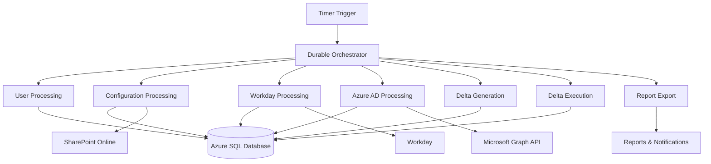
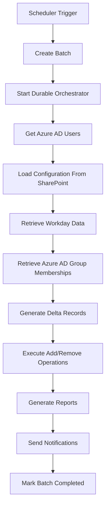
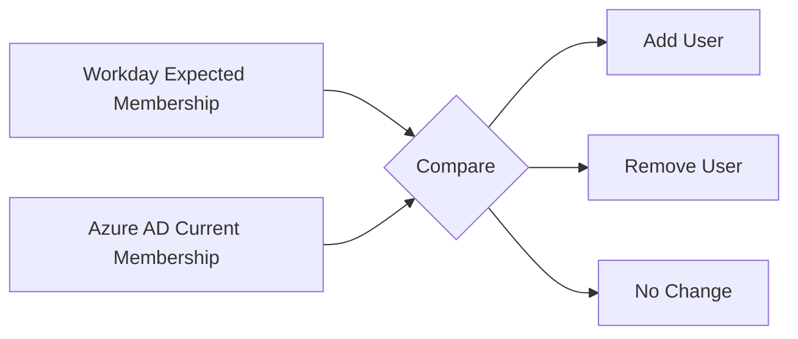
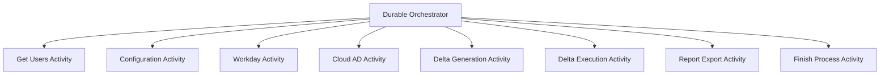
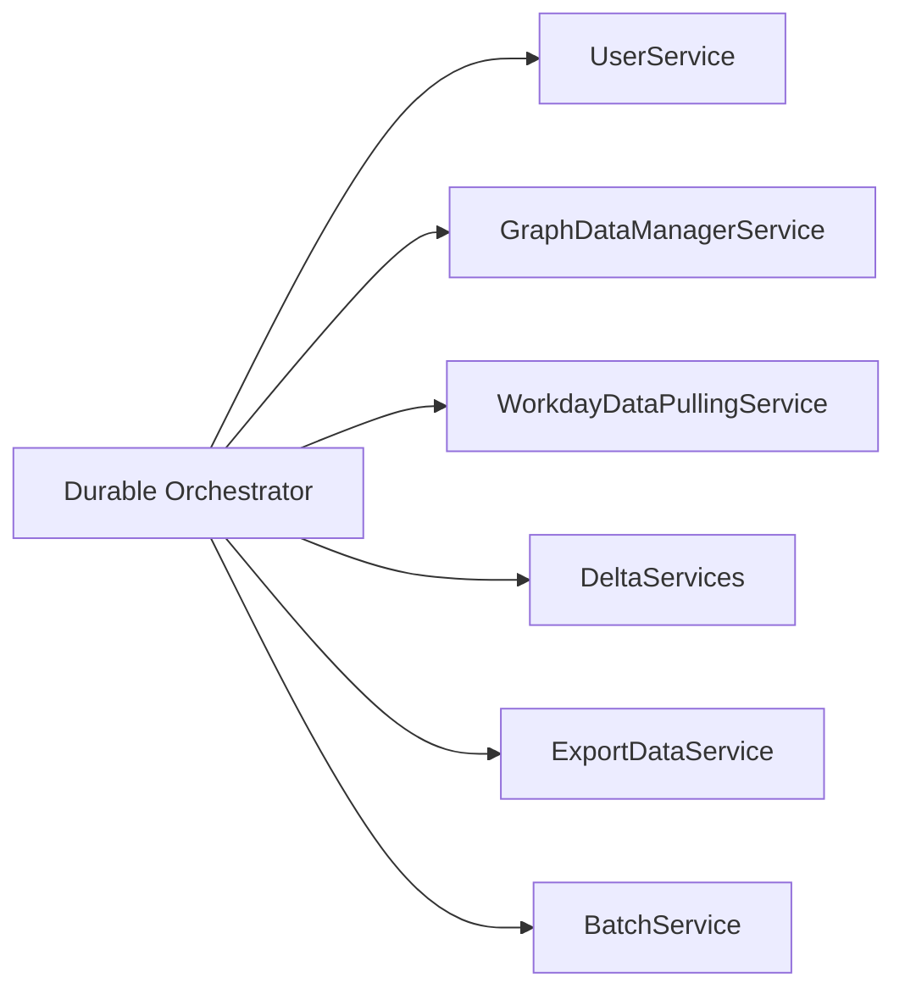

## KHC DDL Automation - Interview Questions & Answers

### 1. Tell me about your current project in which you are working.

I am currently working on the **KHC Distribution List (DDL) Automation Project**, an enterprise-scale automation solution built on **Azure Durable Functions using .NET 8**. The primary objective of this project is to automate the synchronization and management of **Distribution Lists (DLs)** and **Security Groups (SGs)** between multiple enterprise systems such as **Workday, Azure AD (Microsoft Graph), SharePoint, and Azure SQL Database**.
The project eliminates manual group membership management by comparing membership data from authoritative sources like Workday against Azure AD, generating deltas (Add/Remove changes), and automatically updating the groups through Microsoft Graph APIs. It also provides complete auditability, reporting, monitoring, and execution tracking through batch processing and Application Insights.

#### Responsibilities
- Developing and maintaining Azure Durable Functions.
- Integrating Microsoft Graph APIs and Workday APIs.
- Implementing business logic for membership synchronization.
- Optimizing SQL queries and stored procedures.
- Monitoring application performance and handling production issues.
- Implementing logging, exception handling, and resiliency mechanisms.

### 2. What are the functionalities and describe the architecture, technologies, and flow of the project?

#### Functionalities
- Automated retrieval of users from Azure AD.
- Fetching configuration from SharePoint.
- Retrieving employee and group data from Workday.
- Reading existing DL and SG memberships from Azure AD.
- Comparing expected membership with current membership.
- Generating delta records (Add/Remove operations).
- Executing membership updates through Microsoft Graph API.
- Creating audit reports and notifications.
- Maintaining batch execution history and logs.

#### Architecture

#### Main Components

##### Azure Durable Functions
- Scheduler Trigger
- Durable Orchestrator
- Activity Functions

##### Service Layer
- GraphDataManagerService
- WorkdayDataPullingService
- DeltaServices
- UserService
- ExportDataService
- BatchService

##### Data Layer
- Azure SQL Database
- Entity Framework Core
- Stored Procedures

##### External Integrations
- Microsoft Graph API
- Workday API
- SharePoint Online

##### Monitoring
- Application Insights
- Structured Logging
- Email Notifications

#### Technology Stack
- .NET 8
- Azure Durable Functions
- Azure SQL Database
- Entity Framework Core
- Microsoft Graph API
- SharePoint Online
- Application Insights
- Microsoft Azure
- Managed Identity / Service Principal

#### End-to-End Flow

- Scheduler triggers the process.
- Batch record gets created.
- Orchestrator starts execution.
- User data is fetched from Azure AD.
- Configuration is pulled from SharePoint.
- Employee/group data is retrieved from Workday.
- Current group memberships are retrieved from Azure AD.
- SQL stored procedures generate membership deltas.
- Graph API executes required Add/Remove operations.
- Reports are generated and uploaded.
- Notifications are sent.
- Batch is marked completed.

#### Delta Processing Flow

### 3. Have you used any design pattern in your project?

#### Orchestrator Pattern (Azure Durable Functions)

##### Scenario
The synchronization process consists of multiple dependent activities:
- User extraction
- Configuration loading
- Workday processing
- Azure AD processing
- Delta generation
- Delta execution
- Report generation

##### Solution
Implemented a Durable Function Orchestrator to coordinate all activities and maintain execution state.

##### Benefits Achieved
- Workflow checkpointing
- Automatic state management
- Retry handling
- Recovery from failures
- Better monitoring and traceability
- Long-running process support

#### Service Layer Pattern

##### Benefits
- Loose coupling
- High maintainability
- Easy unit testing
- Reusability
- Better separation of concerns

#### Repository Pattern (via EF Core)

##### Benefits
- Centralized data access
- Cleaner code
- Easier transaction management
- Database abstraction

### 4. What challenges did you face and how did you overcome them?

#### Challenge 1: Microsoft Graph API Throttling

**Problem:** API returned HTTP 429 while processing large volumes of users.

**Solution:**
- Implemented retry policies.
- Used exponential backoff.
- Optimized API calls.
- Retrieved only required fields.

**Result:** Improved reliability and reduced synchronization failures.

#### Challenge 2: Large Data Volume Processing

**Problem:** Memory pressure and slow processing caused by large datasets.

**Solution:**
- Implemented batch processing (5000 records).
- Used EF Core entity detachment.
- Added SQL indexing.
- Moved comparison logic to stored procedures.

**Result:** Better performance and reduced memory consumption.

#### Challenge 3: Long Running Workflow Management

**Problem:** Complex dependent processes running for extended durations.

**Solution:**
- Used Azure Durable Functions.
- Leveraged checkpointing and state management.
- Added retry policies.

**Result:** Fault-tolerant and resumable workflows.

#### Challenge 4: Delta Execution Failures

**Problem:** Individual failures could impact overall processing.

**Solution:**
- Implemented record-level error handling.
- Logged failed records with remarks.
- Continued processing remaining records.

**Result:** Improved batch success rate and easier troubleshooting.

### Interview Summary

**Project:** KHC Distribution List Automation
**Technology:** .NET 8, Azure Durable Functions, Azure SQL, Microsoft Graph API, Workday Integration.
**Architecture:** Timer Trigger → Durable Orchestrator → Activity Functions → Service Layer → Azure SQL → Monitoring & Reporting.
**Design Patterns:** Orchestrator Pattern, Service Layer Pattern, Repository Pattern.
**Key Challenges:** Graph API throttling, large-scale data processing, long-running workflows, delta execution failures.
**Achievement:** Automated DL/SG synchronization, reduced manual effort, improved scalability, auditability, and reliability.
