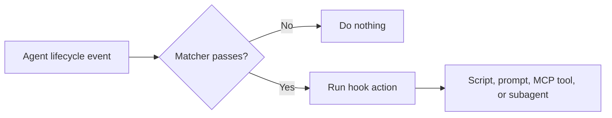

# Claude Code Hooks, Explained Simply


## At a Glance

### What Is a Hook?

A hook is an event-triggered action. When a Claude Code lifecycle event occurs, Claude Code runs a configured script, prompt, MCP tool, or subagent.

### What Is the Use of a Hook?

Hooks make mechanical behavior deterministic. They are useful for formatting files, blocking unsafe commands, saving session summaries, running checks, and starting automated reviews.

### How to Use a Hook

Describe the event, behavior, reason, and important edge cases. Then ask Claude Code to create the hook and test it with a real event. Use a matcher when the hook should run only for a particular tool or condition.

### When to Use a Hook

Use a hook when the behavior is binary, repeatable, and required every time. Keep judgment-based decisions in prompts, skills, or rules instead.

### Example

```text
Create a PostToolUse hook that runs Prettier after source files are changed.
Skip generated files and include a test plan for the matcher.
```

## What Is a Hook?

A hook is an event that triggers a script or another defined action.

- **Event:** When should the behavior run?
- **Script or behavior:** What should happen when it runs?

This is similar to a webhook in traditional software development. Claude Code, acting as the harness, listens for lifecycle events and attaches behavior to the events you select.

A simple model is:

```text
Event + Behavior = Hook
```

For example, a session-end hook could start an agent that summarizes the session and saves the result as a Markdown file in a knowledge base.

## Why Hooks Are Powerful

Language models are probabilistic. Given the same input, an agent may produce different results, and a rule in a prompt or `CLAUDE.md` file is not guaranteed to be followed every time, especially during a long session.

Scripts are deterministic. They can run the same mechanical operation consistently and immediately.

Hooks add this deterministic layer to an otherwise probabilistic agent system. They make selected actions happen automatically instead of relying on the model to decide whether to perform them.

### Rule of Thumb

Use a hook when the check or behavior is:

- Binary
- Mechanical
- Repeatable
- Required every time an event occurs

Keep the behavior at the prompt, skill, or rules level when it requires judgment, interpretation, or context-sensitive reasoning.

## Think in Agent Lifecycle Events

To design a hook, first think about the lifecycle of the coding-agent harness. Common events include:

- A user submits a prompt
- A session begins
- A session ends
- A tool is called
- A subagent is spawned
- The context is compacted
- The agent stops

The exact available events depend on the harness, such as Claude Code, Codex, or GitHub Copilot. The hook connects one of those events to a behavior.

### Hook Lifecycle Visual



The matcher is optional. Without one, the configured action can run for every occurrence of its event.

## Practical Hook Examples

The following examples are conceptual configurations. Claude Code can generate the exact schema and wiring when you describe the event, behavior, purpose, and edge cases.

### 1. Format Files After an Edit

**Goal:** Apply the project formatter after a file-writing tool completes.

```text
Event: PostToolUse
Matcher: file-writing tools only
Behavior: run the project's formatter on the changed file
Why: keep formatting deterministic instead of relying on a reminder in CLAUDE.md
Edge case: skip generated files
```

Possible PowerShell command used by the script:

```powershell
npx prettier --write $ChangedFile
```

### 2. Block a Dangerous Command

**Goal:** Inspect Bash tool calls before they run.

```text
Event: PreToolUse
Matcher: bash
Behavior: reject commands that match a protected production pattern
Why: enforce a mechanical safety rule every time
Edge case: allow an explicitly approved non-production environment
```

This belongs in a hook because the decision is binary and mechanical. A request such as "decide whether this migration is safe" still requires judgment and belongs at the prompt or review-agent level.

### 3. Save a Session Summary

**Goal:** Build persistent project memory after a session ends.

```text
Event: SessionEnd
Behavior: start a separate summarization agent and save a dated Markdown file
Why: preserve decisions, solved problems, and recurring patterns
Edge cases: avoid recursive summaries and limit knowledge-base growth
```

Example output path:

```text
notes/sessions/2026-09-08-authentication-debugging.md
```

### 4. Start an Automated Review

**Goal:** Red-team an implementation when the main agent stops.

```text
Event: Stop
Behavior: spawn a review agent and save its findings
Why: make a review step happen consistently
Edge case: do not start another review for the review agent's own session
```

This pattern can connect multiple Claude Code or coding-agent instances into a larger workflow.

## Useful Hook Setup Prompts

Ask Claude Code to create a hook with a complete request:

```text
Create a PreToolUse hook for Bash commands. If a command targets the production database,
block it and explain why. Allow localhost and staging commands. Ask me any questions you
need before creating the hook, and include a test plan for the matcher.
```

Ask Claude to review an existing hook:

```text
Review the hooks in this project. Identify hooks that run too often, lack matchers,
can recurse into their own sessions, or should be rules instead because they require judgment.
```

## A Four-Part Hook Prompt

When asking Claude Code to create a hook, describe four things:

1. **Event**
   - Identify the lifecycle event that should trigger the hook.
   - Example: run when every session ends.

2. **Behavior**
   - Explain exactly what the hook should do.
   - Example: spawn a separate agent to summarize the session and save the result to a knowledge base.

3. **Why**
   - Explain the motivation and desired outcome.
   - Example: preserve long-term memory of work completed and recurring patterns.

4. **Edge cases**
   - Mention important failure modes or constraints learned from experience.
   - Keep this list lean instead of trying to predict every possible case.

A useful technique is bidirectional prompting: ask the model to ask clarifying questions before it creates the hook.

## Example Hook Request

```text
Can we create a session-end hook that spawns a separate agent to summarize the session into my knowledge base? Run it after every session. The purpose is to preserve memory of what I have worked on and the patterns I use. Watch out for knowledge-base bloat, and do not let subagents or automations summarize their own sessions.
```

Claude Code can handle the schema, wiring, and implementation details. The user can focus on the desired behavior and constraints instead of manually writing every configuration detail.

## Knowledge-Base Example

A session-summary workflow could work like this:

1. The session ends.
2. The hook triggers.
3. A separate agent summarizes the session.
4. The summary is saved as a Markdown file.
5. The collection becomes a searchable, persistent knowledge base.

Important safeguards include controlling knowledge-base growth and preventing recursive summaries of subagent or automation sessions.

## Advanced Hook Capabilities

### Different Action Types

Hooks can trigger more than shell scripts. Depending on the Claude Code configuration and supported hook type, they can also:

- Make an HTTP request
- Invoke an MCP tool
- Run a prompt
- Spawn a subagent

### Hooks in Skills and Custom Agents

A hook can live inside a skill or custom agent. This makes it active only during sessions where that skill or agent is being used.

This is useful for specialized workflows, such as enabling a validation hook only while a particular development skill is active.

### Matchers

Matchers act like conditions at the hook layer. A hook runs only when the event matches the configured pattern.

For example, a matcher for `bash` could make a `PreToolUse` hook run only when the selected tool call is a Bash command.

Matchers reduce unnecessary executions and keep hooks focused on the events that matter.

### Hooks That Spawn Other Agents

A hook can start another agent, Claude Code instance, or Codex instance. For example, when the main coding agent stops, a hook could start a review agent that red-teams the implementation and publishes its analysis.

This makes hooks useful for automated review, verification, and multi-agent workflows.

## Prompt-Level Rules vs. Hooks

Review the instructions in your `CLAUDE.md` and rule files and ask:

```text
Could this be a hook instead?
```

Move a behavior into a hook when it is a mechanical guarantee that must happen reliably. This can reduce instruction bloat and make the agent's behavior more dependable.

Keep a behavior in prompts or rules when the agent must use judgment to decide what is appropriate.

| Requirement | Better location |
| --- | --- |
| Always run a formatter after a specific event | Hook |
| Reject a command matching a fixed pattern | Hook with matcher |
| Decide whether a change needs refactoring | Prompt or rule |
| Explain an architectural tradeoff | Prompt or rule |
| Trigger a fixed review workflow after the agent stops | Hook |

## Practical Design Principles

- Start with the event and behavior, then add the motivation.
- Use hooks for deterministic guarantees, not general instructions.
- Use matchers to avoid running hooks unnecessarily.
- Keep edge cases focused on known risks.
- Evaluate hooks with real runs instead of trying to enumerate every possible edge case in advance.
- Guard against recursive workflows when hooks spawn agents or automations.
- Watch for output or knowledge-base bloat.
- Let Claude Code manage configuration complexity while you specify the intended behavior clearly.

## Key Takeaway

Hooks are the glue between a coding agent's lifecycle and reliable automation. Use prompts and rules for judgment, and use hooks for mechanical behavior that must happen consistently. Once that distinction is clear, hooks can enforce policies, connect tools, preserve memory, launch reviews, and coordinate larger agent workflows.
