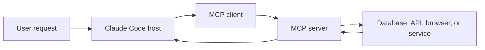
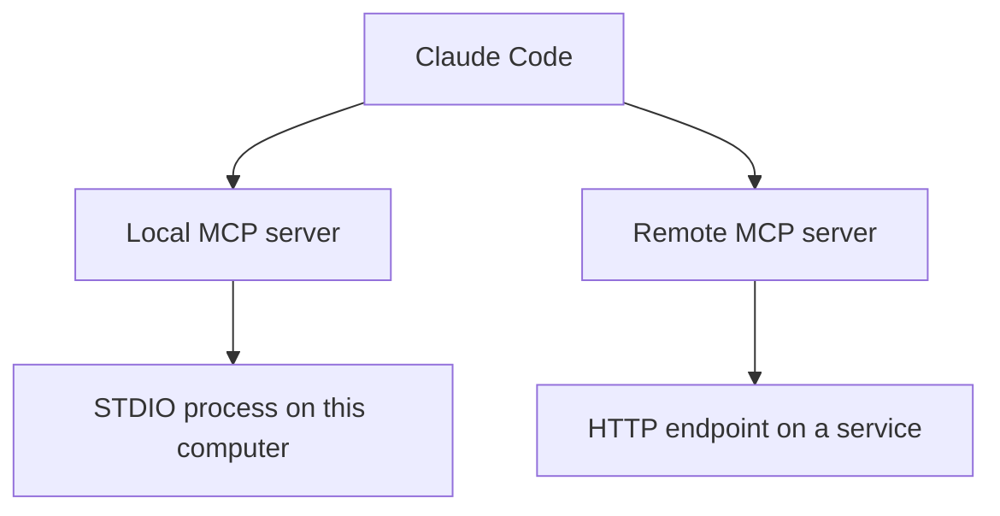
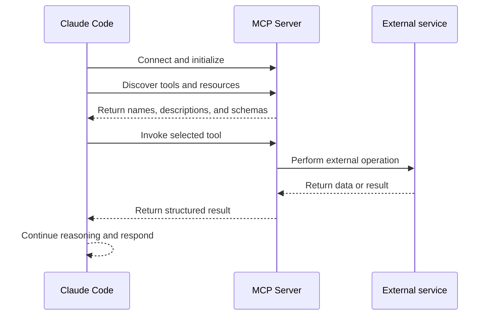

# MCP Servers in Claude Code

## At a Glance

### What Is an MCP Server?

An MCP server is a Model Context Protocol integration that exposes tools, resources, or prompts to Claude Code. It connects Claude Code with external systems such as databases, APIs, browsers, and documentation services.

### What Is the Use of an MCP Server?

MCP servers extend Claude Code beyond the current repository. They let Claude inspect data, retrieve current documentation, browse a website, query a database, or perform an approved action through an external service.

### How to Use an MCP Server

Install or configure the server, choose its scope, start or restart Claude Code, and inspect the connection with `/mcp`. Then explicitly ask Claude to use the server when a task depends on its tools.

### When to Use an MCP Server

Use one when Claude needs external data or capabilities that built-in tools cannot provide. Choose project scope for a shared team integration, global scope for a personal integration used across projects, and local scope for a private current-project setup.

### Example

```text
Use Context7 to check the latest Tailwind documentation and verify
the theme variables in src/app/globals.css.
```

## What Is MCP?

MCP stands for **Model Context Protocol**. It is an open protocol for connecting AI applications to external tools, data sources, services, and APIs.

Claude Code already has built-in tools for working with the current codebase. MCP servers extend those capabilities beyond the repository. An MCP server can expose tools that let Claude interact with databases, documentation systems, browsers, email, project-management systems, or other services.



The external service is accessed by the MCP server. Claude Code does not directly embed every external integration itself; it discovers and calls the tools exposed by the server.

## MCP Architecture

### Host

The host is the AI application, such as Claude Code, that manages the conversation and model interaction.

### Client

The MCP client is the connector inside the host. It establishes communication, negotiates capabilities, discovers tools, and sends requests.

### Server

The MCP server exposes tools, resources, prompts, and metadata. It translates MCP requests into database queries, API calls, browser actions, file operations, or other backend work.

```text
Claude Code host
    -> MCP client
        -> STDIO or HTTP transport
            -> MCP server
                -> External API, database, browser, or service
```

## What MCP Servers Can Provide

| Capability | Purpose | Example |
| --- | --- | --- |
| Tool | Performs an operation | Query a database or open a browser |
| Resource | Provides structured context | Read project documentation |
| Prompt | Provides a reusable instruction template | Run a standard research workflow |

Tools can have side effects, so they need clear descriptions, input validation, authorization, and appropriate approval controls.

## Example: Supabase MCP Server

A Supabase MCP server might expose tools to:

- List database tables
- Read table schemas
- Execute SQL commands
- Deploy edge functions

A request such as this could use those tools:

```text
Read the blogs table in Supabase and build an interface that displays its records.
```

The workflow is:

1. Claude checks the tools available from connected MCP servers.
2. It finds a Supabase tool that can inspect the database.
3. The MCP server queries Supabase.
4. The server returns the table structure or records.
5. Claude uses the returned data to design the interface.

## Useful MCP Servers

### Context7

Context7 provides current documentation for many frameworks and libraries. It is useful when implementing a feature that depends on third-party documentation.

Example prompt:

```text
Check the latest Tailwind CSS documentation with Context7 and verify whether
my theme variables are correctly configured in src/app/globals.css.
```

Using current documentation reduces the chance that Claude generates code based on outdated training data.

### Playwright

The Playwright MCP server provides browser interaction tools. It can allow Claude to:

- Open a browser
- Navigate to a URL
- Inspect page elements
- Click links
- Test user flows
- Take screenshots
- Review a page's user experience

Example prompt:

```text
Use Playwright to open the local application, inspect the main dashboard,
and summarize any visible UX problems.
```

### Other Integrations

MCP servers can connect Claude to many other services, including:

- Databases
- Documentation platforms
- Gmail or Outlook
- CRM systems
- Issue trackers
- Financial systems
- Internal company APIs

Use a trusted MCP directory or the service's official documentation to find available servers.

## Local and Remote MCP Servers

MCP servers can run locally or remotely.



### Local STDIO Server

A local server is launched as a process on the same machine. Communication commonly uses standard input and output.

```json
{
  "mcpServers": {
    "project-docs": {
      "command": "npx",
      "args": ["-y", "project-docs-mcp"]
    }
  }
}
```

### Remote HTTP Server

A remote server runs elsewhere and is accessed through a URL. Authentication may be required.

```json
{
  "mcpServers": {
    "company-docs": {
      "type": "http",
      "url": "https://mcp.example.com/docs",
      "headers": {
        "Authorization": "Bearer ${COMPANY_MCP_TOKEN}"
      }
    }
  }
}
```

The exact configuration fields vary by client and server. Always use the current server documentation for the final command and transport settings.

## Adding an MCP Server with Claude Code

The general command for adding a server is:

```text
claude mcp add <server-name> -- <command> <arguments>
```

For a project-scoped local server:

```text
claude mcp add --scope project context7 -- npx -y <context7-package>
```

For a server available to all projects for the current user:

```text
claude mcp add --scope global context7 -- npx -y <context7-package>
```

The available scopes are:

| Scope | Who can use it? | Typical use |
| --- | --- | --- |
| `project` | Everyone working on the repository | Shared team integration committed with the project |
| `local` | Only you in the current project | Personal project-specific integration |
| `global` | You across projects | Personal server used everywhere |

The default scope may be local, so specify `--scope project` or `--scope global` when that is the intended behavior.

## Windows Command Considerations

When a local server uses `npx` on native Windows, the command may need to be run through `cmd /c`:

```text
claude mcp add --scope project context7 -- cmd /c npx -y <context7-package>
```

- `cmd` opens the Windows command interpreter.
- `/c` runs the command and closes the shell afterward.
- The package name and flags must come from the MCP server's current installation instructions.

Some Windows setups may encounter argument parsing issues with the `-y` flag. A practical workaround is:

1. Add the server without `-y`.
2. Let the package installation prompt complete.
3. Inspect the generated project configuration.
4. Add `-y` manually to the arguments array if the server requires automatic confirmation.
5. Restart Claude Code and test the connection.

This behavior can change as Claude Code and MCP servers evolve, so verify current Windows instructions before troubleshooting too deeply.

## Project Configuration

Project-scoped servers are commonly recorded in a project MCP configuration file such as `.mcp.json` at the repository root.

Example project layout:

```text
project/
├── .mcp.json
├── CLAUDE.md
└── src/
```

A local Windows configuration may look conceptually like this:

```json
{
  "mcpServers": {
    "context7": {
      "type": "stdio",
      "command": "cmd",
      "args": ["/c", "npx", "-y", "<context7-package>"]
    },
    "playwright": {
      "type": "stdio",
      "command": "cmd",
      "args": ["/c", "npx", "<playwright-package>"]
    }
  }
}
```

Do not commit secrets to `.mcp.json`. Use environment variables or the authentication mechanism recommended by the server.

## Checking MCP Connections

Inside Claude Code, use the MCP command to inspect configured servers and connection status:

```text
/mcp
```

A healthy connection should show the server as available or connected. If a server fails to connect:

1. Check the command and package name.
2. Confirm that the required runtime is installed.
3. Check whether the server expects STDIO or HTTP.
4. Verify Windows `cmd /c` wrapping when applicable.
5. Review environment variables and authentication.
6. Restart Claude Code after changing configuration.
7. Reconnect and run `/mcp` again.

## MCP Communication Lifecycle



The typical lifecycle is:

1. Connect to the local process or remote endpoint.
2. Initialize and negotiate capabilities.
3. Discover tools, resources, and prompts.
4. Let Claude determine whether a capability is relevant.
5. Invoke a tool or read a resource.
6. Return structured results to the model.

## MCP and Project Memory

If a server should be used for a recurring type of work, record that preference in project memory:

```text
Use Context7 to check current documentation whenever you implement a feature
using a third-party framework or library.
```

This gives Claude a consistent reminder, while the MCP server supplies the actual external capability and current data.

## Security and Permissions

Treat MCP servers as integrations with real access to data and actions.

- Install servers from trusted sources.
- Review the tools and permissions they expose.
- Do not place API keys directly in committed configuration.
- Use environment variables for secrets.
- Require approval for destructive or sensitive actions.
- Be cautious with tools that execute SQL, modify production data, or send messages.
- Remember that external content can contain prompt-injection attempts.
- Limit a server's scope to the projects or users that need it.

## Key Takeaway

MCP servers extend Claude Code beyond the repository by exposing discoverable tools, resources, and prompts for external systems. Use project scope for shared integrations, global scope for personal cross-project tools, and local scope for private project settings. Configure the correct transport, verify connections with `/mcp`, protect secrets, and explicitly name the MCP server when a task depends on its capabilities.
