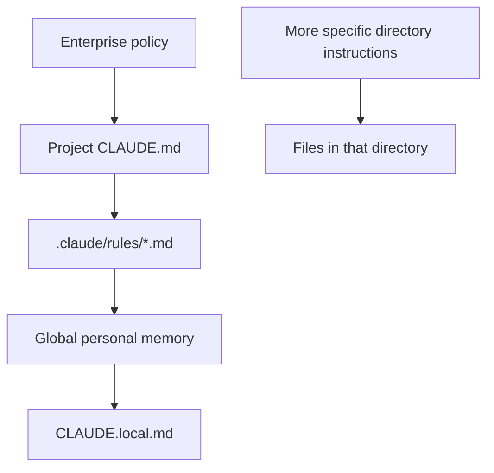

# How to Use CLAUDE.md in Claude 


## At a Glance

### What Is `CLAUDE.md`?

`CLAUDE.md` is a Markdown instruction and memory file that gives Claude Code persistent context about a project, its architecture, conventions, commands, and known lessons.

### What Is the Use of `CLAUDE.md`?

It reduces repeated repository exploration and prevents Claude from guessing about project standards. Teams can share project instructions, while local files can hold personal preferences that should not be committed.

### How to Use `CLAUDE.md`

Run `/init` to generate a starting file, then customize it. Add concise commands, architecture notes, coding rules, testing guidance, and references to detailed rule files. Use `/memory` when managing remembered lessons.

### When to Use `CLAUDE.md`

Use it for guidance that should apply across normal conversations in a project. Put specialized, path-specific, or conditional behavior in `.claude/rules/`, skills, or hooks instead.

### Example

```markdown
# Project Instructions

## Commands

- `npm test` runs the test suite.
- `npm run lint` checks formatting and style.

## Rules

- Add tests for behavior changes.
- Do not edit generated files in `dist/`.
```

## Why CLAUDE.md Matters

`CLAUDE.md` is Claude Code's project memory. Claude reads it when starting work, so it can retain context across sessions instead of repeatedly exploring the repository or guessing about its conventions.

Use it to document:

- The project's architecture
- The technology stack
- Important files and directories
- Coding standards and patterns
- Mistakes that have already been discovered
- Lessons from difficult debugging sessions

A good `CLAUDE.md` helps Claude work like a senior teammate who already understands the project.

## Getting Started

Do not write the first version from scratch. Run:

```text
/init
```

Claude Code will explore the repository, inspect files such as `package.json`, scan the directory structure, identify important patterns, and create an initial summary. Customize that generated file with project-specific knowledge, then improve it over time.

## CLAUDE.md Memory Hierarchy

Claude Code can load instructions from several levels. When instructions conflict, the higher-priority instructions take precedence.

1. **Enterprise policy**
   - Set by the organization
   - Highest priority
   - Cannot be overridden by project or personal instructions

2. **Project `CLAUDE.md`**
   - Usually stored in the project root
   - Commonly committed to Git and shared with the team
   - Contains project-wide architecture, conventions, and workflow guidance

3. **Project rules**
   - Stored in the `.claude/rules/` directory
   - Markdown files can separate rules by concern, such as testing or security
   - Rules can be scoped to particular file paths

4. **Personal global memory**
   - Stored in the user's home Claude configuration directory
   - Contains personal preferences that apply across projects

5. **Project-local `CLAUDE.local.md`**
   - Intended for personal project notes and preferences
   - Typically excluded from Git
   - Useful for local environment details that should not be shared

### Memory Hierarchy Visual



Higher-level instructions establish broader constraints, while directory-level files add context for the code they are closest to.

## Example Project CLAUDE.md

Here is a compact example for a TypeScript project:

````markdown
# Project Instructions

## Stack

- TypeScript with strict mode enabled
- Node.js services under `src/`
- Vitest tests under `tests/`

## Common Commands

```text
npm install
npm run dev
npm test
npm run lint
```

## Working Rules

- Keep business logic in `src/services/`.
- Add or update a test for every behavior change.
- Do not edit generated files in `dist/`.
- Run the focused test before the full test suite.

## Additional Context

@docs/architecture.md
@.claude/rules/testing.md
````

This example gives Claude useful project context without repeating every implementation detail in the main file.

## Example Directory Layout

```text
project/
├── CLAUDE.md
├── CLAUDE.local.md
├── .claude/
│   └── rules/
│       ├── testing.md
│       └── security.md
├── docs/
│   └── architecture.md
└── src/
   └── frontend/
      └── CLAUDE.md
```

For example, `src/frontend/CLAUDE.md` can contain UI-specific conventions while the root file contains rules shared by the whole repository.

## Modular Rules

Large projects can split instructions into focused files under:

```text
.claude/rules/
```

For example:

```text
.claude/rules/testing.md
.claude/rules/security.md
.claude/rules/frontend.md
```

Rules can also be path-specific, so a rule is loaded only when Claude is working on matching files. This keeps instructions relevant and prevents the main `CLAUDE.md` from becoming too large.

Subdirectories can have their own `CLAUDE.md` files. For example, a frontend directory can contain frontend-specific instructions.

## Importing Additional Context

The `@` syntax can import content from another file. Use it to keep the main `CLAUDE.md` concise while storing detailed instructions elsewhere.

File references can also cause Claude to load a `CLAUDE.md` from the referenced directory. Claude Code can additionally reference external URLs or documentation when that context is needed.

## Compounding Engineering Workflow

When a difficult bug is solved, preserve the lesson instead of letting it disappear with the session. Ask Claude to summarize the debugging process and add the result to project memory.

A useful prompt is:

```text
We finally fixed it. Summarize all the rabbit holes we went through so we avoid these mistakes in the future. Add it to the project memory.
```

The resulting note should explain:

- What went wrong
- Why it happened
- Which approaches did not work
- How to prevent the issue in the future

Over time, each solved problem improves the project's shared memory. The same class of bug becomes less likely to happen again. You can manage memory with:

```text
/memory
```

This debugging-summary workflow can also be turned into a custom slash command so it is easy to repeat.

## Practical Maintenance Tips

1. Run `/init` first, then customize the generated file.
2. Keep `CLAUDE.md` concise because it is loaded in every conversation.
3. Date important lessons so their context is clear.
4. Use directory-level `CLAUDE.md` files for focused rules.
5. Use file references and modular rules to keep detailed guidance separate.
6. Review the file periodically and remove outdated or duplicated instructions.

A bloated or stale `CLAUDE.md` can reduce the quality of Claude's results. Ask Claude to audit it with a prompt such as:

```text
Please review our CLAUDE.md file and highlight any parts we should simplify or remove because they are duplicated or outdated.
```

## Key Takeaway

Treat `CLAUDE.md` as living project documentation. Start with `/init`, add lessons from real work, separate detailed rules into modules, and periodically remove anything that is no longer useful. This turns Claude Code's memory into a compounding engineering advantage.
