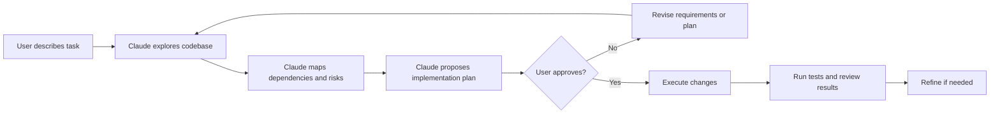
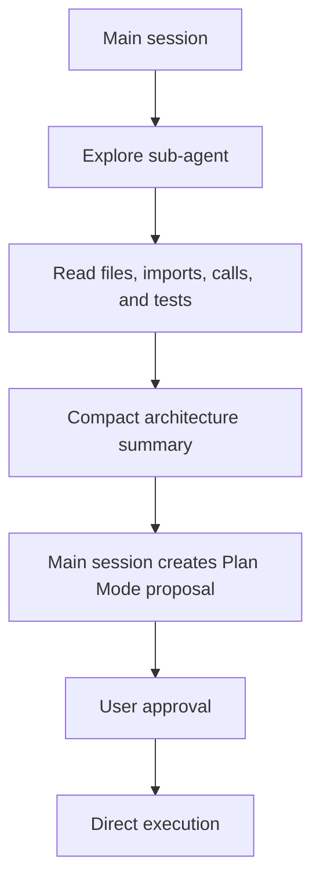

# Plan Mode in Claude Code

## At a Glance

### What Is Plan Mode?

Plan Mode is a discovery and design phase in which Claude studies the codebase and proposes changes before editing files.

### What Is the Use of Plan Mode?

It makes architecture decisions, dependencies, risks, alternatives, and validation steps visible before a costly change begins. It gives the user a review and approval checkpoint.

### How to Use Plan Mode

Start Claude Code in plan permission mode or ask Claude to enter Plan Mode. Describe the goal and constraints, review the proposed plan, revise it if needed, and explicitly approve execution.

### When to Use Plan Mode

Use it for ambiguous, broad, architectural, security-sensitive, or expensive-to-reverse work. Direct execution is usually better for a clear one-file fix or another small reversible change.

### Example

```text
Enter Plan Mode. Explore the authentication flow, identify affected files,
compare migration options, and do not edit files until I approve the plan.
```

## What Is Plan Mode?

Plan Mode is an investigation and design phase before Claude changes files. Claude studies the relevant code, maps dependencies, identifies risks, compares possible approaches, and presents a proposed implementation plan for review.

The core distinction is:

```text
Clear, local, reversible task -> Direct execution
Ambiguous, broad, architectural task -> Plan Mode first
```

Plan Mode is not a replacement for execution. It is a checkpoint that helps the user understand and approve important decisions before side effects occur.

## Plan Mode Workflow



A good plan should make the intended changes visible before implementation begins.

## When to Use Plan Mode

Use Plan Mode when:

- The change affects many files.
- Requirements are ambiguous or incomplete.
- Several reasonable architectures exist.
- The change is expensive to reverse.
- Dependencies are tightly coupled or unclear.
- A migration, refactor, or re-architecture is involved.
- The change affects security, production data, or system boundaries.
- A human approval checkpoint is important.
- You are creating a new application foundation.

Typical examples include:

- Re-architecting authentication
- Extracting services from a monolith
- Replacing a data-access layer
- Changing a framework or persistence strategy
- Designing a new API and database model
- Planning a large migration

## When Direct Execution Is Better

Direct execution is appropriate when the destination is already clear and the correction cost is low.

Use it when:

- The target files are known.
- The request is specific.
- The change is small and local.
- There is one obvious reasonable approach.
- The output is predictable.
- The change is easy to review or revert.

Examples:

- Fix a one-file bug from a clear stack trace.
- Update a known configuration value.
- Add tests for an existing function.
- Change a function signature in an identified file.
- Apply a small UI adjustment.

### Direct-Execution Example

```text
In src/agent.py, change process_refund to accept a list of order IDs.
Update its unit tests and run the targeted test file.
```

The file, behavior, tests, and validation command are already clear, so a separate architecture plan would add unnecessary delay.

## Plan Mode Commands and Prompts

The exact controls depend on the Claude Code version and client. A CLI session can be started in plan permission mode with:

```powershell
claude --permission-mode plan
```

Inside a supported Claude Code session, you can also ask directly:

```text
Enter Plan Mode. Explore the authentication flow and propose a migration plan.
Do not edit files until I approve the plan.
```

For a new application, use a prompt that makes the planning boundary explicit:

```text
Before writing code, propose the folder structure, core modules, data models,
API endpoints, testing strategy, and major tradeoffs. Do not create files until
I approve the plan.
```

After reviewing the result, move to execution explicitly:

```text
The plan is approved. Implement steps 1 through 4, then run the focused tests.
Do not expand the scope without asking me first.
```

## What a Good Plan Contains

A useful plan should identify:

- The files and modules that will change
- The current architecture and relevant entry points
- Dependencies and call paths
- Proposed folder or module boundaries
- Data-model or API changes
- Migration order
- Testing and validation commands
- Risks and rollback considerations
- Alternatives that were considered
- Questions that require user input

Avoid plans that only restate the request. The plan should explain how the repository will change and why that approach is appropriate.

## Plan Mode as a Human Checkpoint

Before approving a large plan, review:

- Whether the affected files are complete
- Whether the proposed boundaries match the existing architecture
- Whether data migrations are reversible
- Whether security and permissions are preserved
- Whether tests cover the changed behavior
- Whether the plan introduces unnecessary complexity
- Whether the execution order avoids broken intermediate states

The user can revise or reject the plan before Claude makes broad changes.

## Explore Sub-Agents and Context Size

A large repository may require more discovery than the main session can comfortably hold. An explore sub-agent can inspect the codebase and return a compact summary before the main session creates the plan.



An explore sub-agent and Plan Mode solve different problems:

| Mechanism | Primary purpose |
| --- | --- |
| Explore sub-agent | Reduce main-session context pressure during discovery |
| Plan Mode | Design and review the implementation approach |

They can be combined as:

```text
Explore sub-agent -> Plan Mode -> User approval -> Direct execution
```

## Common Failure Without a Plan

If Claude is told to convert a large monolith into services and starts editing immediately, it may:

- Modify files before understanding all dependencies.
- Create inconsistent intermediate states.
- Break imports and tests.
- Choose an approach that is difficult to reverse.
- Miss migration or rollback requirements.

The issue is not that Claude cannot edit files. The issue is that execution began before the system-level design was understood.

## Iterative Refinement

Planning and execution should be iterative:

```text
Plan -> Review -> Approve or revise -> Execute -> Test -> Refine
```

Give specific feedback instead of vague instructions.

Avoid:

```text
Make it better.
```

Prefer:

```text
The error handler in process_refund does not preserve the original exception.
Keep the original error, add the order ID to the log context, and update the
focused tests before changing any other files.
```

## Quick Decision Checklist

Ask these four questions:

1. Does the change affect more than one file non-trivially?
2. Are there multiple reasonable approaches?
3. Would reversing a wrong approach be expensive?
4. Could the change alter architecture or system boundaries?

If any answer is strongly yes, start with Plan Mode. If all answers are no and the request is precise, direct execution is usually appropriate.

## Key Takeaway

Use Plan Mode when understanding the system and choosing the approach matters more than making the first edit quickly. Review and approve the plan, then switch to direct execution, test the result, and refine it with concrete feedback.
