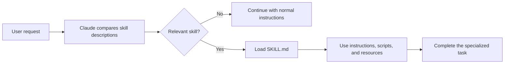

# Claude Skills Explained


## At a Glance

### What Is a Claude Skill?

A Claude Skill is a reusable folder of instructions, scripts, and resources that teaches Claude how to perform a specialized workflow. Its description helps Claude decide when it is relevant.

### What Is the Use of a Skill?

Skills package repetitive work once so Claude can reuse it across conversations. They can standardize code reviews, commit messages, presentations, email summaries, financial reports, and other focused workflows.

### How to Use a Skill

Create or install a skill containing `SKILL.md`, give it a clear description and examples, then test it with a natural request. If Claude does not activate it, mention the skill name directly in the prompt.

### When to Use a Skill

Use a skill for specialized knowledge that should load only when a matching task is requested. Use `CLAUDE.md` for guidance that belongs in every conversation, and use hooks for deterministic behavior that must always run.

### Example

```text
Use the code-review skill to review this pull request, group findings
by severity, and follow the team's security checklist.
```

## What Are Claude Skills?

Claude Skills are reusable packages of instructions and tools that give Claude a specialized ability. They are useful for repetitive workflows that you want to perform consistently, such as:

- Creating a PowerPoint presentation from an outline
- Summarizing email and drafting replies
- Reviewing financial information
- Evaluating new AI tools
- Applying a consistent theme or design system

A skill packages a workflow once so Claude can recognize and reuse it across conversations. Skills can be used across Claude surfaces that support them, including Claude.ai, Claude Desktop, and Claude Code.

## How Claude Discovers Skills

Each skill is a folder containing a `SKILL.md` file and, when needed, supporting scripts or resources. The skill's description tells Claude when the skill is relevant. Claude initially uses the available skill names and descriptions rather than loading every skill into every conversation.

When a request matches a description, Claude reads that skill's instructions and applies them to the task.



This on-demand behavior is what makes skills different from instructions that load in every conversation.

## Skill Locations in Claude Code

Choose the location based on who should receive the skill:

- **Personal skills:** `~/.claude/skills/` on macOS/Linux or `$HOME\.claude\skills\` in PowerShell. These follow you across projects and can contain personal preferences, commit message formats, or documentation conventions.
- **Project skills:** `.claude/skills/` in the repository root. These can be committed to Git so everyone who clones the project receives the same team standards.

A typical project skill looks like this:

```text
.claude/
└── skills/
	└── code-review/
		├── SKILL.md
		├── checklist.md
		└── scripts/
			└── collect-diff.ps1
```

The `SKILL.md` file should explain the workflow, include a clear description of when to use it, and reference any supporting resources.

## Useful Claude Code Commands and Prompts

Create a project skill directory in PowerShell:

```powershell
New-Item -ItemType Directory -Force .claude\skills\code-review
code .claude\skills\code-review\SKILL.md
```

Create a personal skill directory in PowerShell:

```powershell
New-Item -ItemType Directory -Force "$HOME\.claude\skills\commit-style"
code "$HOME\.claude\skills\commit-style\SKILL.md"
```

Ask Claude to create the skill interactively:

```text
Make a new skill for reviewing pull requests using our team's checklist.
Ask me clarifying questions before writing SKILL.md.
```

Use the skill naturally after it is installed:

```text
Review this PR using the code-review skill and group feedback by severity.
```

If Claude does not activate it, name the skill explicitly:

```text
Use the code-review skill to review the current changes.
```

Skills are automatic and task-specific. They are not slash commands, so you do not need to type a command such as `/code-review` to activate one. A normal request is enough when the wording matches the skill description.

## Built-In Skills

Claude includes built-in skills for common tasks. Examples shown in the video include:

- PowerPoint creation
- Theme Factory
- Canvas Design
- Artifacts Builder
- Skill Creator

To explore skills in Claude.ai:

1. Sign in with a supported paid account.
2. Open the profile menu.
3. Go to **Settings**.
4. Open **Capabilities**.
5. Find the **Skills** section.
6. Enable the skills you want to use.

The tutorial specifically enables Skill Creator, Theme Factory, Canvas Design, and Artifacts Builder.

## How a Skill Is Used

When Claude receives a prompt, it checks whether an available skill matches the requested workflow. If it finds one, Claude reads the skill file, follows its instructions, and uses the tools defined by that skill.

For example, a PowerPoint workflow can work like this:

1. Provide Claude with an outline.
2. Claude recognizes that the presentation skill applies.
3. Claude reads the skill instructions.
4. The skill provides the steps and tools needed to create the deck.
5. Claude makes design decisions and produces the presentation.
6. A separate theme skill can later apply brand colors, patterns, and other visual choices.

The benefit is that the workflow does not need to be rebuilt with custom instructions for every project or conversation.

## Creating a Custom Skill

Use the built-in **Skill Creator** to create a reusable skill.

Start a new chat and ask Claude:

```text
Make a new skill.
```

Claude reads the Skill Creator guide and asks questions about the workflow. The exact questions may vary, but the important information usually includes the following.

### 1. Define the Workflow

Explain what repeated task the skill should handle.

Example:

```text
Create an AI FOMO summarizer that evaluates new AI tools and recommends which ones deserve attention.
```

### 2. Provide Concrete Examples

Examples teach Claude when the skill should activate and what inputs look like.

For example, define a recognizable trigger containing the name of a new tool and a link to its announcement or press release.

### 3. Explain What Makes the Skill Personal

Describe the criteria Claude should use to produce a useful result. This might include:

- Your work responsibilities
- Your personal productivity goals
- Your interests
- Your existing knowledge
- The type of recommendation you want

If Claude does not have enough information, allow it to ask a limited number of follow-up questions.

### 4. Answer Clarifying Questions

When Claude asks what else it should clarify, answer carefully. Skipping this step can produce a vague skill with unreliable results.

Once Claude has enough information, it generates the skill file.

## Installing a Custom Skill

After Claude creates the skill file:

1. Click the download button.
2. Return to **Settings**.
3. Open **Capabilities**.
4. Scroll to **Skills**.
5. Select **Upload Skill**.
6. Drag the downloaded skill file into the upload area.
7. Confirm that the skill appears as successfully uploaded.

Open a new chat and use the skill's trigger words to test it.

## Testing and Improving a Skill

The first result will often need refinement. Test the skill with realistic inputs and inspect both the process and the final result.

To modify a skill:

1. Return to the chat where the skill was created.
2. Ask Claude for a specific change.
3. Review the updated skill.
4. Download the revised file.
5. Upload the updated file through the Skills settings.
6. Test it again in a new chat.

For example, a report that has one overall score could be updated to include separate scores for work relevance and personal productivity.

## Skills and MCP Servers

Skills can call MCP servers, allowing Claude to interact with external applications and services. Possible integrations include:

- Gmail
- Outlook
- CRM systems
- QuickBooks Online
- Other tools exposed through MCP

For example, a finance skill can retrieve data from QuickBooks and summarize income and expenses. The skill combines the application's data access with a repeatable analysis and reporting workflow.

## Connecting Gmail to a Skill

A skill can summarize important unread email and draft suggested responses.

To connect Gmail in Claude.ai:

1. Open a new chat.
2. Click the search and tools icon in the prompt area.
3. Select Gmail Search.
4. Choose **Continue**.
5. Follow the account-connection prompts.
6. Confirm the successful connection notification.

After the connection is established, Claude can search email. The email workflow can then be packaged as a skill:

1. Ask Claude to create a new skill.
2. Describe the email summary workflow and desired output.
3. Answer the Skill Creator's questions.
4. Install the generated skill.
5. Open a new chat.
6. Use the skill's trigger phrase and a time period, such as `Gmail summary yesterday`.
7. Review the important messages and draft responses it produces.

## Trigger Words and Reliability

Skill detection is still imperfect. Claude may not always identify a skill from an indirect request.

If Claude stops finding a skill reliably, include the skill's name directly in the prompt. Using the exact skill name gives Claude a stronger signal that the workflow should be activated.

Good trigger design should be:

- Specific enough to distinguish the workflow
- Easy to remember
- Closely related to the skill's name
- Supported by concrete examples in the skill definition

## General Skill Design Principles

- Package repetitive workflows once and reuse them.
- Give the skill concrete examples of valid inputs.
- Explain the personal or business context that makes the output useful.
- Let Claude ask clarifying questions when essential information is missing.
- Start with a focused workflow instead of trying to solve every related task.
- Test the first version with realistic examples.
- Iterate based on actual results.
- Re-upload the skill after making changes.
- Use MCP when the workflow needs data or actions from another application.
- Include the skill name directly in prompts when detection is unreliable.

## Key Takeaway

A Claude Skill is a reusable workflow that combines instructions, tools, examples, and context. Built-in skills provide ready-made capabilities, while Skill Creator helps package personal workflows for repeated use. With MCP connections, skills can reach external applications and turn tasks such as presentation design, financial analysis, and email triage into repeatable processes.
